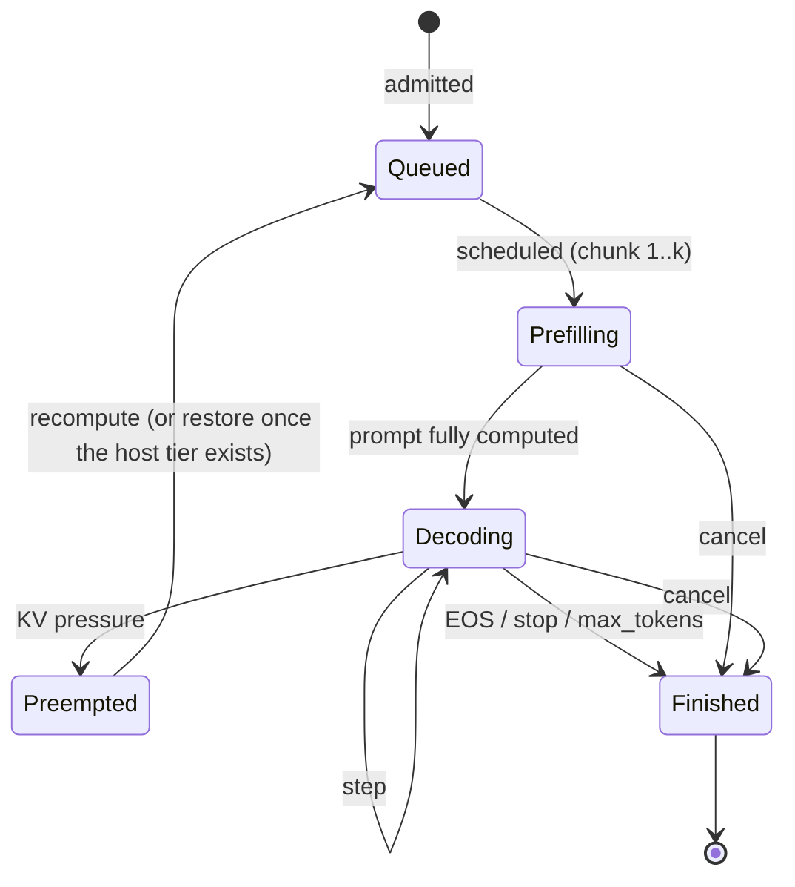
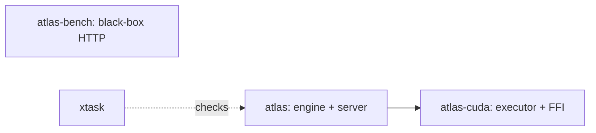
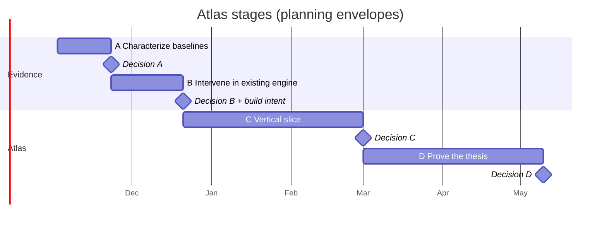

# Atlas: A Focused Rust LLM Serving Experiment (Design Doc + Roadmap)

*Codename “Atlas” is a placeholder. Version 0.3, October 2026. Open-source experiment; scope is one NVIDIA GPU, with CPU used only for host-side development and small reference checks. This version incorporates the v0.3 principal review; Appendix B lists every change from v0.2.*

**Status: proposal, not a performance claim. No Atlas measurements are presented here.** Baseline gaps, library integration feasibility and supported feature combinations must be verified before implementation commitments. Ecosystem facts move fast; verify anything marked ⚠️.

---

## 0. TL;DR

**What this is:** an open-source experiment to build a focused Rust LLM serving engine and test one thesis: **reuse-aware KV residency and scheduling can raise successful multi-turn serving goodput at fixed latency, quality and resources, compared with tuned vLLM and SGLang.**

**What it is not:** a general-purpose inference platform, a claim that Rust makes inference faster, or an attempt to match vLLM’s breadth.

**Initial scope:**

- One exact dense model (Llama-3.1-8B-Instruct, BF16 weights and KV) on one recorded H100 80 GB configuration; single process, single GPU.

- Continuous batching, chunked prefill and paged KV as prerequisites, not differentiators.

- Prefix reuse and a bounded host-DRAM KV tier, only if baseline measurements justify them.

- CPU for host-side development and small reference checks; not a serving backend.

- Everything else (MoE, tensor parallelism, quantization, router, disaggregation, other accelerators, ...) is deferred and evidence-gated (§1.5, §8).

**Success target (provisional; frozen after baselines):** ≥ 1.30× sustainable request goodput on the primary workload versus the best tuned baseline, with no quality regression and within the guardrails in §7.4. At unchanged infrastructure cost that is about **23.1% lower cost per successful request**. A 25% cost reduction would need ≥ 1.333× goodput or cheaper resources.

**How decisions are made:**

1. **Measure first.** Stage A characterizes the baselines and bounds the possible gain before any Atlas code exists.

2. **Prototype where it’s cheapest.** If feasible, test the intervention inside an existing engine first (Stage B).

3. **Build intent is a separate, recorded decision.** The goal includes an open-source Rust engine, which an upstream contribution alone doesn’t satisfy. Stage C may follow a positive upstream result if that intent is recorded (§12.8). Atlas is then compared against baselines that *include* any contributed policy.

4. **Freeze the workload, SLOs, minimum effect and resource budget before evaluating the candidate.** Publish negative results too.

**Engineering stance:**

- Rust is the control-plane implementation language: explicit ownership, native concurrency, no GIL. It does not by itself guarantee deterministic execution, zero allocation, faster kernels or a static portable binary.

- Existing CUDA libraries (cuBLASLt, FlashInfer) provide the data plane wherever practical.

- No public backend trait, model IR or large crate graph is frozen before a real CUDA vertical slice works. Start with three crates and split on evidence (§6).

---

## 1. Problem Framing

### 1.1 First-principles model

For a kernel or a sufficiently homogeneous execution segment,  a useful lower bound is:

$$

T_{\text{segment}} \gtrsim \max\left(\frac{F}{P_{\text{eff}}},\ \frac{B_{\text{HBM}}}{BW_{\text{eff}}}\right) + T_{\text{unhidden overhead}}

$$

$F$ is executed FLOPs, $B$ is bytes moved, and effective compute and bandwidth are measured for the relevant shapes. A model step is a dependency graph of such segments, so one roofline maximum is not an exact step predictor. Transfers, collectives and host work matter only when they extend the critical path rather than overlap it.

Request latency also includes tokenization, queueing, cache restoration, execution and output delivery. Near saturation, a small service-time change causes a large queueing change; measure both.

Prefill often becomes compute-bound at sufficient token batch size. Low-batch decode often becomes weight-bandwidth-bound. Long context, larger batches and communication can move the bottleneck. Neither label is a universal scheduling rule.

**Bound the improvement before building (Amdahl).** If a removable stall is fraction $f$ of the execution critical path, removing it gives at most $1/(1-f)$. A 2% stall permits about 1.02×; 1.30× needs about 23.1% removable time. This bounds execution speed, not tail latency under queueing, which needs a load sweep. It is also why “lower CPU overhead” alone cannot be the thesis.

### 1.2 Cost

$$

\text{cost per M successful output tokens} = \frac{\text{total infrastructure cost during the window}}{\text{output tokens from successful, SLO-compliant requests}} \times 10^6

$$

Also report cost per successful request. Count GPU, CPU, RAM and any extra services; label GPU-only estimates as such. Cached input tokens are not newly generated output tokens. Shorter, truncated or invalid outputs never count as improvements.

### 1.3 When KV restoration pays (illustrative; replaced by Stage A measurements)

For conventional dense attention with uniform layers, uncompressed KV storage is about $2 \cdot L \cdot H_{kv} \cdot D_{head} \cdot b$ bytes per token. For Llama-3.1-8B (32 layers, 8 KV heads, head dimension 128, BF16) that is **128 KiB/token**, so a 16,384-token prefix is **2 GiB** before metadata.

| Path | Illustrative cost for a 16K-token prefix |

| --- | --- |

| Restore from host at an assumed 25 GB/s effective | ≈ 86 ms of copy, which can partly overlap other compute |

| Recompute | ≈ 2.6e14 FLOPs dense (2 × params × tokens) + ≈ 7.0e13 FLOPs causal attention ≈ 3.3e14 FLOPs → ≈ 0.6 s at an assumed 550 TFLOP/s effective, competing with other requests |

| Capacity | ≈ 55 GB free HBM holds ≈ 25 such prefixes; 200 GB of host memory ≈ 93 |

Restore only when expected avoided recomputation outweighs transfer, queueing and residency opportunity costs. Measure that threshold across context lengths, reuse distances and concurrent load. A higher cache hit rate is a diagnostic, not the success metric. MLA and hybrid-state models need different accounting.

### 1.4 Hypotheses and experiments

Each experiment states a baseline loss, an achievable upper bound, the intervention, confounders and the falsifying observation. Do not assume a baseline lacks a capability; check current versions.

| ID | Hypothesis | Cheapest discriminating experiment | Drop or stop when |

| --- | --- | --- | --- |

| **H1: residency** (primary) | On the primary trace, avoidable re-prefill of reusable prefixes materially limits goodput after baseline offload is tuned. | Compare tuned vLLM and SGLang with their supported cache/offload configurations; record restored bytes, repeated prefill, reuse distance and queueing. Test a measured restore-versus-recompute policy. | An existing configuration closes the gap, restoration costs more than recomputation, or no material reusable working set exists. |

| **H2: scheduling** (adjacent) | A fixed chunk/residency policy loses goodput across changing load because it misses latency and reuse trade-offs. | Replay a fixed time-varying load trace; compare an adaptive policy against both the best fixed configuration for that trace and load-specific tuned configurations. | Gains disappear against fair tuning, violate fairness, or are explained by different admission/output behavior. |

| **H3: host overhead** (conditional) | Unhidden host work creates material GPU gaps in the selected operating regime. | Collect scheduler/output timings and GPU timelines; bound the gain with $1/(1-f)$, then test an overlap or native hot-path intervention. | The critical-path fraction is too small to justify the work, or the baseline already hides it. |

H1 is the thesis. If H1 fails, stop; a different thesis needs a new review, not automatic scope expansion. Run one intervention at a time and reprofile after each improvement, because the bottleneck may move.

v0.2’s “features don’t compose” and “static speculation configs” hypotheses are now follow-up composition experiments (§5.7), not part of the thesis.

### 1.5 Scope and non-goals

**Initial scope**

- One exact checkpoint: **Meta-Llama-3.1-8B-Instruct, BF16 weights and KV**, subject to access and license approval. Record its revision and artifact hashes. If unavailable, choose and freeze a replacement before baseline runs.

- One H100 80 GB configuration. Record PCIe or SXM variant, power limits, CPU, RAM, topology, driver and CUDA versions. Never mix results from different configurations.

- Single process, single GPU, streaming Chat Completions for the subset the workload needs.

- Continuous batching, chunked prefill and paged KV as prerequisites.

- Prefix reuse and a bounded host-DRAM KV tier only if Stage A justifies them.

- Tenant-scoped caching; basic admission, cancellation, backpressure and health.

**Deferred** (each needs user demand, hardware access, a measured bottleneck and a separate scope decision): MoE, MLA, hybrid-state models, tensor/expert/pipeline parallelism, router, prefill/decode disaggregation, LoRA, multimodal, quantization, learned draft models, a general graph compiler, CPU serving, and TPU/AMD/other backends.

**Follow-up composition tests, not prerequisites:** structured output and prompt-lookup speculation. The primary trace initially replays fixed tool results without grammar enforcement, so no constrained-output performance can be claimed from it.

---

## 2. What To Take From Existing Engines

### 2.1 Lessons table

|  | **vLLM** | **SGLang** | **TensorRT-LLM** |

| --- | --- | --- | --- |

| **Best idea** | PagedAttention + continuous batching; separated engine core; broad model/hardware coverage | RadixAttention prefix reuse; overlap scheduler; HiCache tiering; structured-output pipeline | Kernel quality; AOT warmup and CUDA graph discipline |

| **Adopt in Atlas** | Ref-counted blocks, token-budget scheduler, chunked prefill | Prefix reuse semantics; overlap later, under the §5.7 contract | Plan-then-run execution; bounded graph buckets; warmup before serving |

| **Measure in Stage A (don’t assume a gap)** | Prefix caching and KV offload behavior on multi-turn traces; remaining host gaps in the current version | HiCache residency behavior; remaining host gaps with overlap on | Optional extra baseline; not evidence of an automatic kernel advantage |

All three already use native code, overlap techniques and prefix caching in some form. Compare traces, not language labels or feature lists.

### 2.2 Prior art

- **FlashInfer:** paged/ragged attention with a plan/run API. Evaluate it for Atlas; calling it from Rust is not a trivial cubin-linking task (§5.6). ⚠️ Check license, API and packaging.

- **Sarathi-Serve:** stall-free chunked prefill; the model for unified prefill/decode batches.

- **LMCache, SGLang HiCache:** KV offload and tiering; the H1 baselines. ⚠️ Fast-moving.

- **mistral.rs, candle:** study before choosing the Rust/CUDA integration.

- **llguidance, xgrammar:** evaluate only when structured output enters scope.

- **Future references, not a feature list:** DistServe, Splitwise, Mooncake, Dynamo/NIXL, llm-d, TensorRT-LLM, speculative-decoding literature, S-LoRA/Punica, JAX/Pallas.

---

## 3. Design Principles

1. **Measure before building.** Every component traces to the thesis (§1.4) or a prerequisite (§1.5).

2. **Control plane in Rust, data plane in libraries and kernels.** Rust orchestrates; it does not do per-token math.

3. **Ragged-first batches.** One step format covers prefill chunks and decode.

4. **Start serial, overlap when measured.** Begin with submit, poll, reconcile. Overlap only when traces show material host gaps, and only under the §5.7 contract.

5. **Preallocate what matters.** Steady-state device workspace and reusable metadata buffers are preallocated; scheduler and executor allocations are measured. No blanket zero-allocation rule for frontend or parser code.

6. **Validate combinations, not feature lists.** Capabilities describe supported (model, attention layout, dtype, execution mode) combinations. Unsupported configurations fail at startup.

7. **Correctness contracts before performance features.** KV invariants (§5.3) and resource lifetimes are specified and tested before overlap or tiering.

8. **Cost per successful request** is the metric (§1.2), not raw tokens/sec.

9. **Borrow kernels.** Write small ones only when integration or profiling requires it.

10. **Python-free serving path.** Python is allowed at build and test time, never in the request path.

11. **Explicit composition.** Each implemented feature combination has a correctness contract and a test. Unimplemented combinations are rejected, not silently degraded.

12. **Tenant-scoped by default.** Namespaces prevent cross-tenant prefix reuse; they do not remove every timing channel (§5.3).

13. **Don’t freeze APIs early.** Backend traits, model IRs and crate splits follow a working vertical slice, not precede it.

---

## 4. System Architecture

### 4.1 Minimal architecture (initial milestone)

```mermaid

flowchart LR

    API[”HTTP + streaming frontend\n(tokenize, template, detok, stop buffer)”] --> E[”Engine owner\nadmission, scheduler, KV metadata”]

    E --> D[”CUDA executor\nbuffers, kernels, events”]

    D --> E

    E --> OUT[”Bounded output delivery”]

    E --> HOST[”Optional bounded host KV tier\n(only if H1 survives)”]

```

Not drawn, because not approved: overlapped execution, grammar workers, speculation, router, KV transfer, multi-GPU. Each is added to this diagram only when its scope decision passes (§8).

### 4.2 Ownership, threads and process model

- One process, one GPU.

- A `tokio` runtime for HTTP and SSE.

- **One engine thread** owns request state, scheduling and logical KV metadata (single writer).

- **One executor** owns device allocations, streams and submissions.

- Tokenization, detokenization and output delivery run off the scheduling critical path.

- Bounded channels on every edge. No custom lock-free structures are required.

- A context-poisoning CUDA error restarts the serving process (§5.10). Process-per-device isolation is a later option, not an initial feature.

### 4.3 Request lifecycle



`Finished` releases logical ownership immediately. Device resources are released only after every in-flight step that references them completes (§5.3, invariant 2).

---

## 5. Component Design

### 5.1 Frontend

- **Libraries:** `axum` + `tokio` (HTTP/SSE), HF `tokenizers`, `minijinja` for chat templates. Verify exact template parity with the reference before trusting any benchmark.

- **API surface:** the streaming Chat Completions subset the primary workload needs. Completions, Responses, embeddings and gRPC come later.

- **Tool calls:** only what the primary trace needs. Per-model parser plugins come later.

- **Incremental detokenization** runs off the engine thread.

- **Stop strings:** a pending-output buffer holds back any text that could still begin a stop sequence. Already-delivered output can’t be trimmed, so nothing is streamed until the stop check clears it. Test UTF-8 boundaries, disconnects and slow clients.

- **Bounds:** request size, queued work, generated length, host memory and output buffers are all bounded. Reject early with 429. Output delivery never stalls the engine: slow clients are disconnected, without freeing in-flight resources early.

### 5.2 Engine and scheduler

**Scheduling model:** token budget with unified prefill and decode, in the style of Sarathi-Serve and vLLM V1. Each step fills its budget in order: running decodes, then in-progress chunked prefills, then new admissions that fit the KV budget.

**Execution boundary** (conceptual, not frozen; §5.4): *submit a batch, poll completion, reconcile the result.* The initial loop is serial: one step in flight (Appendix A).

**Policy:** start with FCFS and a fixed chunk size. Add a private policy trait only when a second policy exists; the adaptive policy is H2 and evidence-gated.

**Preemption:** recompute first. Swap to the host tier only after the tier exists and the restore-versus-recompute table says it pays.

**Reconcile rules:**

- Commit tokens and KV only for completed steps.

- Publish prefix blocks only after their writes complete (invariant 1).

- EOS and cancel release logical ownership at once; device resources are released only after in-flight work that references them completes (invariant 2).

### 5.3 KV cache manager

This is where the thesis lives, so its correctness contract comes first.

**Required invariants**

1. **Reservation is not publication.** A planned KV write reserves capacity; only completed, validated writes can become reusable prefix entries.

2. **Logical lifetime is not device lifetime.** Cancellation or EOS can end a request while later submitted work still references its blocks. Reuse requires all request, cache and in-flight references to be released and the relevant completion events to pass.

3. **Reused IDs cannot alias old work.** References carry allocation generations (or equivalent protection against stale handles). Test cancellation followed by immediate reuse.

4. **Committed length is authoritative.** Track committed tokens separately from reserved capacity and speculative writes. Rejected or unwritten slots are never visible as attention context.

5. **Shared blocks are immutable.** Share only completed full blocks, or copy-on-write shared partial tails. Another request can never extend a cached prefix in place.

6. **Capacity is bounded.** Admission and preemption stay within fixed device and host budgets, including metadata, graph/workspace buffers, transient transfers and a safety margin. Validate memory under the real mixed workload, not one maximum-shape forward pass.

7. **Transfers have states.** Distinguish resident, copying, ready, failed and retiring blocks. Never expose a destination before the copy completes, or free a source the copy still needs.

Tests must cover cancellation during copy, eviction during prefetch, stale tickets, partial prefix matches, transfer failure and cleanup after a device error. Use model-based tests against a naive implementation, plus GPU race and memory checks for executor lifetimes.

**Cache identity and isolation**

- Cache identity = tenant namespace + model/weight revision + effective positional/attention configuration + KV dtype/layout + token prefix. Adapters or multimodal inputs, if added later, join the key. Token IDs alone are not enough.

- Sharing is tenant-scoped by default; cross-tenant sharing is opt-in.

- A noncryptographic hash is an index, not proof of identity. Verify the full identity before reuse, or adopt an explicitly justified collision-safe design (for example a keyed cryptographic hash).

- Retention and cleanup are bounded. Logs and diagnostic dumps never contain prompt text by default.

- Namespaces prevent cross-tenant prefix reuse. They do not remove timing channels from shared scheduling, memory pressure or GPU resources. Hard isolation needs separate resources and is out of scope.

**Residency policy**

- Start with one page size, one full-attention cache group, an ordinary prefix index and LRU eviction. No hybrid cache groups, radix routing summaries or hash-chain machinery until needed.

- Measure reusable tokens and bytes, not just request-level hits.

- Add the host tier only after H1 survives Stage A. Bound pinned memory; measure NUMA placement and effective copy bandwidth under concurrent compute.

- Restore complete required ranges before execution first. Add bounded prefetch only when traces show useful overlap; limit wasted prefetch and avoid eviction/restore cycles.

- Restore-versus-recompute decisions start as a measured lookup table over context size and load. A simulator and detailed GPU-time attribution are not prerequisites.

**Memory planning:** budget = device memory − weights − workspace − graph buffers − metadata − transient transfer buffers − safety margin. Plan once at startup, validate under the mixed workload, and never call `cudaMalloc` in the executor’s steady state.

### 5.4 Execution boundary and capabilities

One engine thread owns request state, scheduling and logical KV metadata. One executor owns device allocations and submissions. The boundary between them is conceptually **submit a batch, poll completion, reconcile the result**:

- **Inputs:** token and position information, valid sequence lengths, logical page references and sampling parameters.

- **Outputs:** sampled tokens, completion status and measured timings.

Keep page references opaque and generation-tagged outside the executor. Host pinning, CUDA streams and graph capture are executor concerns. The boundary is a *private* trait inside the `atlas` crate (a CUDA adapter and a test mock implement it), frozen as ADR 1 only after the vertical slice works (C-08).

**Capabilities validate combinations, not independent lists.** Unsupported configurations fail at startup:

```rust

// Illustrative: the executor accepts only configurations it has been tested with.

struct SupportedConfig {

    model: ModelRevision,       // exact checkpoint revision and hash

    attention: AttentionLayout, // e.g. full attention, page size 16

    kv_dtype: DType,            // BF16

    mode: ExecutionMode,        // Eager | DecodeGraphs

}

```

### 5.5 Model code and weights

- Implement the selected dense architecture in ordinary Rust code that calls executor operations. No macro-op IR, no graph compiler, no `CustomOp` registry.

- Extract a model representation only when a second architecture is approved and shows what is actually shared.

- Weights: `safetensors` via `mmap` → pinned staging → device, with artifact-hash verification and a load-time metric. No quantized formats in the initial milestone.

### 5.6 CUDA integration

Use cuBLASLt for BF16 GEMM and evaluate FlashInfer for paged attention. Reuse established norm, RoPE, activation and sampling implementations where licensing and ABI permit. Write small kernels only when integration or profiling requires them.

**Prove the stack before committing to it:** a Rust-to-library attention call, its metadata preparation, and a captured decode step with changing inputs (C-05 to C-09). Verify AOT packaging, workspace requirements, current APIs and licenses. Reusing a library is not automatically a trivial cubin-linking task.

| Need | Initial choice | Later, only if profiling justifies |

| --- | --- | --- |

| Dense GEMM (BF16) | cuBLASLt | CUTLASS fused epilogues |

| Paged attention (prefill + decode) | FlashInfer, if C-07 to C-09 pass | Own decode kernel |

| Norm, RoPE, activation, sampling | Reuse where license/ABI permit; otherwise small custom kernels | Further fusion |

| KV write, host-tier copies | Small custom kernel; async copies on a dedicated stream | Batched copy kernels |

- **Memory:** preallocate steady-state device workspace and reusable metadata buffers. Measure scheduler and executor allocations and remove the ones that matter.

- **CUDA graphs:** add decode graphs after eager correctness. Bound the bucket set and measure padding waste and graph memory.

- **Streams:** compute plus copy streams with explicit events; the executor owns all of them.

- **Packaging:** `atlas-cuda/build.rs` runs `nvcc` for `ATLAS_CUDA_ARCHS`; only a small C ABI header crosses into Rust (§6.2).

- **Distribution:** a Linux CUDA container with pinned dependencies. A Rust executable does not make CUDA, kernel libraries or driver dependencies disappear, so no fully static or universally portable binary is promised. Windows is fine for host-side work; validate CUDA work on the Linux target.

### 5.7 Overlap and feature composition (follow-ups, not prerequisites)

Each of these is a later experiment with explicit costs, not a promise that the feature is free.

| Feature | Correctness contract | Performance question |

| --- | --- | --- |

| **Overlapped steps** | Device token dependencies are explicit; every submitted step retains referenced buffers and blocks until completion. Start with at most two in-flight steps and test against the serial reference. | How much unhidden host time is removed, and how much work is wasted after stop/cancel? |

| **Structured output** | The grammar mask reflects the entire committed prefix at sampling time. A late mask may gate the whole batch; claim per-sequence fallback only after proving that ready sequences can proceed independently. | Mask preparation/upload tails and sampling stalls under realistic schemas. |

| **Prompt-lookup speculation** | Verification preserves the target sampling distribution: proposal, acceptance and correction rules, position/KV rollback and RNG behavior. Greedy agreement alone does not prove stochastic correctness. | Accepted tokens per unit device time, and goodput across load including draft and verification cost. |

| **Grammar + speculation** | Advance grammar state only through accepted tokens; constrain drafts and verification consistently; restore state after rejection. | Whether the combination beats the best eligible configuration without relaxing validity. |

| **Forced grammar spans** | Forced text skips sampling decisions, but its KV must be materialized before later generation depends on it. | Whether fewer calls outweigh processing the span and any retokenization. |

Variable speculative acceptance means future positions, valid lengths and slot mappings are not known on the host. Do not overlap speculative steps until a coherent device-resolved metadata and rollback protocol exists; serialize the combination and report the cost honestly.

**Budget note:** Stage D’s chat guardrail (≥ 0.95× best-baseline goodput) may itself require hiding host overhead, because tuned baselines already overlap scheduling with execution. If Stage C traces show material host gaps on short chat, overlapped steps are budgeted inside Stage D (D-08).

### 5.8 CPU reference and future accelerators

- A tiny CPU/reference implementation is **optional**. It can validate operators and scheduler semantics; it is not required to run every model. Prefer external fixtures from a pinned HF reference when they are cheaper and more independent. CPU FP32 is a reference, not an infallible oracle for fused or quantized kernels.

- The **mock executor** tests scheduling and resource-lifetime ordering. It says nothing about GPU numerics or accelerator portability.

- **Future accelerators:** the only constraint today is that CUDA concerns (streams, pinning, graphs, raw pointers) stay inside the executor, behind opaque page references. No static-shape mode and no portability claims.

### 5.9 Deferred components

None of these get crates, reserved fields or placeholder traits until their scope decision passes (§8). Recorded here so the initial design doesn’t accidentally preclude them.

| Component | Earliest trigger | Design note to keep in mind |

| --- | --- | --- |

| Tensor/expert/pipeline parallelism | A model that doesn’t fit one GPU is approved | Keep collectives out of engine code |

| Router and prefill/decode disaggregation | Multi-replica traffic with measured interference | Needs a separate KV transport with its own failure states |

| Quantization (FP8, INT4, FP4) | Demand plus hardware plus quality harness | Quantization becomes part of cache identity (§5.3) |

| Multi-LoRA, multimodal | User demand | Adapter/encoder identity joins the cache key |

| NVMe or remote KV tiers | Working set exceeds host DRAM on real traces | Same transfer-state contract (invariant 7) |

| Learned speculation (EAGLE, MTP) | Prompt-lookup speculation proves the composition contract | Same verification semantics as §5.7 |

| Structured-output engine (llguidance vs. xgrammar) | Constrained-output workload added to §7.1 | Mask timing contract in §5.7 |

| Other accelerators | Community traction and a maintainer | Executor-only CUDA concerns (§5.8) |

### 5.10 Observability and operations

**Minimum telemetry:** admission and rejection counts, queue age, batch composition, TTFT and streaming latency, step duration, GPU gaps, repeated-prefill tokens, resident and restored KV bytes, transfer time, allocation pressure and per-class success.

- `tracing` spans per request and per step; Prometheus-style metrics.

- No high-cardinality tenant or request labels in public metrics.

- Logs, metrics and diagnostic dumps exclude prompt and output text by default.

- A redacted step flight recorder (shapes, IDs, timings of the last N steps) is dumped on error.

- GPU-time attribution and a simulator are not prerequisites; add them when a decision needs them.

**Failure handling**

| Failure | Behavior |

| --- | --- |

| Client disconnect / cancel | Release logical ownership at once; release device resources only after in-flight steps that reference them complete |

| KV exhaustion | Admission and preemption stay within fixed budgets; reject with 429 before queues grow without bound |

| Context-poisoning CUDA error | Fail outstanding requests, keep a redacted diagnostic record and restart the serving process. Never restart a thread inside a poisoned context. No silent automatic retries: they need caller-level duplicate-output handling |

| Hung GPU work | A step watchdog treats expiry as a fatal device error |

| Graceful drain | Stop admission; finish or time out outstanding requests; exit |

| Health | `/health` reports process health; `/ready` requires loaded weights and completed initialization, and is false while draining |

---

## 6. Repository Layout and Rust Engineering Practices

This section is the reference for *how* code is written. §12 is the reference for *what* to build next. It applies from Stage C; Stages A and B need only the benchmark tooling.

### 6.1 Lessons from Rust open-source projects

| Project | What Atlas adopts |

| --- | --- |

| **rust-analyzer** | Flat `crates/` folder under a virtual root manifest; folder name = crate name; an `ARCHITECTURE.md` that lists invariants and boundaries; `cargo xtask` instead of shell scripts; one integration-test binary per crate (`tests/it/main.rs`) |

| **Ruff / uv (Astral)** | `[workspace.dependencies]` and `[workspace.lints]` as the single source of truth; snapshot tests for API output; a thin binary over library code |

| **tokio** | Never block the async runtime; model-check custom concurrency only if any is ever written |

| **TiKV** | Failpoints (`fail` crate) for fault-injection tests such as cancellation during copy or a device error |

| **candle, mistral.rs** | `build.rs` compiling CUDA sources; `half` for BF16; how existing Rust engines bind CUDA libraries. Read before choosing the binding |

| **HF TGI** | axum OpenAI-compatible frontend with a validation layer and the engine behind a channel |

| **Rust API Guidelines** | Naming, conversion traits, `Debug` on public types, error types |

**vLLM structural pain points, and the Atlas rule for each:**

| Pain point | Atlas rule |

| --- | --- |

| One large package where entrypoints, model code, kernels, distributed and platform code import each other freely | Enforced module and crate boundaries (§6.3); engine code can’t see CUDA types |

| Behaviour spread across many environment variables and a very large CLI flag surface | One typed config tree (TOML + serde, `deny_unknown_fields`), a few CLI overrides, env vars only for logging and paths |

| Platform checks scattered through model and scheduler code | CUDA concerns live only in `atlas-cuda`; supported configurations are validated at startup |

| Feature combinations that silently break | Unimplemented combinations are rejected at startup; implemented ones each have a contract and test (§5.7) |

| Model files mixing math, weight loading, quantization and parallelism | One architecture in plain code; weights in their own module; no parallelism yet |

### 6.2 Starting layout and split triggers

Stage C starts with **three crates plus `xtask`**. No empty future crates.

```

atlas/

├─ Cargo.toml                 # virtual manifest: members, workspace deps, lints, profiles

├─ Cargo.lock                 # committed

├─ rust-toolchain.toml        # pinned when Stage C starts

├─ rustfmt.toml

├─ clippy.toml

├─ deny.toml                  # licenses, advisories, sources

├─ .gitattributes             # * text=auto eol=lf

├─ .cargo/config.toml         # xtask alias only

├─ .config/nextest.toml       # serial test group for GPU tests

├─ .github/workflows/         # host.yml (every PR), cuda.yml (device changes + nightly), perf.yml

├─ ARCHITECTURE.md            # module map + §5.3 invariants + boundaries

├─ CONTRIBUTING.md

├─ LICENSE

│

├─ crates/

│  ├─ atlas/                  # engine + server binary

│  │  ├─ src/

│  │  │  ├─ main.rs

│  │  │  ├─ config.rs          # one typed config tree, validated at startup

│  │  │  ├─ server/            # axum routes, SSE, admission, tokenizer, template, detok, stop buffer

│  │  │  ├─ engine/            # engine thread, request state, scheduler, reconcile

│  │  │  ├─ kv/                # block pool, generation-tagged refs, prefix index, eviction, host tier

│  │  │  ├─ executor.rs        # private Executor trait: CUDA adapter + test mock (not a public API)

│  │  │  └─ telemetry.rs       # metrics, spans, redacted flight recorder

│  │  └─ tests/it/              # host-side integration tests

│  │

│  ├─ atlas-cuda/             # executor + FFI; the only crate allowed to use unsafe

│  │  ├─ build.rs               # nvcc for ATLAS_CUDA_ARCHS

│  │  ├─ include/atlas_cuda.h   # the only ABI that crosses into Rust

│  │  ├─ csrc/                  # shims over FlashInfer and small kernels

│  │  ├─ third_party/           # pinned submodules

│  │  ├─ src/                   # device, memory, forward pass, graphs, sampling

│  │  └─ tests/it/              # GPU tests (serial group)

│  │

│  └─ atlas-bench/            # black-box HTTP load generator and report

│     ├─ src/                   # client, trace replay, SLO accounting, cost, report

│     ├─ workloads/             # frozen §7.1 trace definitions

│     └─ baselines/             # pinned vLLM / SGLang launch configs

│

├─ xtask/                     # ci, fixtures, module-boundary checks

├─ python/                    # build/test time only: reference fixtures, baseline scripts

├─ testdata/                  # tiny fixtures; large artifacts fetched by hash

└─ docs/                      # this document, ADRs, experiment notes with source revisions

```

**Split triggers** (split only when the trigger fires):

| Split out | When |

| --- | --- |

| `atlas-core` (engine + kv) | Host test or compile times hurt, or a second executor exists |

| Shared types crate | Two crates need the same types |

| Simulator | H2 policy work needs repeatable experiments beyond the lookup table |

| CPU reference executor | External fixtures stop being sufficient |

| Router | A multi-replica need is approved (§8) |

### 6.3 Dependency and module rules



1. Inside `atlas`, `engine/` and `kv/` never import tokio, axum or `atlas-cuda` types. `cargo xtask boundaries` checks this, so a later split stays cheap.

2. `atlas-bench` has no internal dependencies; it measures Atlas, vLLM and SGLang through the same HTTP interface.

3. `unsafe` is allowed only in `atlas-cuda`.

4. `anyhow` is allowed only in binaries and `xtask`.

### 6.4 Workspace configuration

Pin the toolchain and exact tested dependency versions when Stage C starts, not in this document. The shape is what matters here.

**Root `Cargo.toml`**

```toml

[workspace]

resolver = “3”

members = [”crates/*”, “xtask”]

[workspace.package]

edition = “2024”

license = “Apache-2.0”

publish = false

[workspace.dependencies]

atlas-cuda = { path = “crates/atlas-cuda” }

# external crates: exact tested versions, added as each is first used

[workspace.lints.rust]

unsafe_code = “deny”            # atlas-cuda opts out with #![allow(unsafe_code)] in lib.rs

unsafe_op_in_unsafe_fn = “deny”

missing_debug_implementations = “warn”

unreachable_pub = “warn”

[workspace.lints.clippy]

all = { level = “warn”, priority = -1 }

undocumented_unsafe_blocks = “deny”

dbg_macro = “deny”

await_holding_lock = “deny”

unwrap_used = “warn”

print_stdout = “warn”

cast_possible_truncation = “warn”

[profile.dev.package.”*”]

opt-level = 2                   # keeps tokenizer and loader dependencies fast in tests

[profile.release]

debug = “line-tables-only”      # usable profiles and Nsight stacks

lto = “thin”

[profile.profiling]

inherits = “release”

debug = true

```

CI runs clippy with `-D warnings`, so every `warn` fails CI without blocking local iteration.

**Member `Cargo.toml`** (every crate):

```toml

[package]

name = “atlas”

version = “0.1.0”

edition.workspace = true

license.workspace = true

publish.workspace = true

[dependencies]

atlas-cuda.workspace = true

# each external dependency: `<name>.workspace = true`

[lints]

workspace = true

```

**Other root files**

| File | Contents |

| --- | --- |

| `rust-toolchain.toml` | `channel` = current stable at Stage C; components `rustfmt`, `clippy`. Bump in its own PR |

| `rustfmt.toml` | Stable options only: `edition = “2024”`, `max_width = 100`, `use_field_init_shorthand = true`, `newline_style = “Unix”` |

| `clippy.toml` | `allow-unwrap-in-tests`, `allow-expect-in-tests`, `allow-dbg-in-tests` = true |

| `deny.toml` | Permissive license allow-list; deny unknown registries and git sources; deny `openssl` (use rustls); record any NVIDIA redistribution decision |

| `.config/nextest.toml` | `ci` profile with JUnit output; `gpu` test group with `max-threads = 1` for `package(atlas-cuda)` |

| `.cargo/config.toml` | `[alias] xtask = “run --package xtask --”` |

| `.gitattributes` | `* text=auto eol=lf` |

### 6.5 Library candidates (verify before use)

| Area | Candidates | Check before adopting |

| --- | --- | --- |

| HTTP and streaming | `tokio`, `axum`, `tower-http` | SSE flushing; slow-client handling |

| Engine channels | `crossbeam-channel`, `tokio::sync::mpsc` | Bounded on every edge; the engine never awaits |

| Tokenizer and template | `tokenizers`, `minijinja` (+ Python-compat helpers) | Exact parity with the reference chat template |

| Weights | `safetensors`, `memmap2` | Hash verification; load time |

| CUDA binding | `cudarc`, or a hand-written driver FFI | Coverage of the needed APIs; graph capture; license |

| Numerics | `half`, `bytemuck` | BF16 layout matches the kernels |

| Prefix identity | Full identity comparison, or a keyed cryptographic hash such as `blake3` | §5.3: a fast noncryptographic hash is only an index |

| Errors | `thiserror` in libraries; `anyhow` only in binaries and `xtask` | One error enum per module boundary |

| Config and CLI | `serde` + `toml`, `clap` | `deny_unknown_fields`; validation at startup |

| Telemetry | `tracing`, `metrics` + a Prometheus exporter | Low-cardinality labels; no prompt text |

| Testing | `cargo-nextest`, `proptest`, `insta`, `fail` | Model-based KV tests; failpoints for lifetimes |

| Bench client | `reqwest` (rustls), `hdrhistogram` | Event timestamps exactly as §7.2 defines them |

### 6.6 Coding conventions

- **Errors:** libraries return typed errors (`thiserror`); no panics on recoverable paths; `expect(”invariant: ...”)` states the invariant. An executor error that may have poisoned the context is fatal for the process (§5.10).

- **Handles:** block and request references are newtypes carrying a generation (for example `BlockRef { id: u32, generation: u32 }`), per invariant 3. Never pass raw integer IDs across modules.

- **Ownership:** the engine thread owns request and KV metadata; other threads talk to it through bounded channels. No `Arc<Mutex<Scheduler>>`. Never block a tokio worker.

- **Unsafe:** only in `atlas-cuda`. Every block has a `// SAFETY:` comment (enforced by clippy). Every device resource is an RAII type. Raw pointers never leave the crate.

- **Allocation:** measure scheduler and executor allocations and preallocate the ones that matter. No blanket zero-allocation rule.

- **Reproducibility:** inject the clock and a seeded RNG into the engine so host tests are repeatable. This is a testing aid, not a claim of deterministic GPU execution.

- **Config:** one typed tree with defaults, validated at startup and dumped (redacted) in diagnostics. Environment variables only for logging and paths.

- **Privacy:** logs, metrics and diagnostic dumps exclude prompt and output text by default.

- **Visibility:** default to `pub(crate)`; `unreachable_pub` keeps the surface honest. `ARCHITECTURE.md` lists invariants; a PR that changes one updates it.

- **Tests:** the cheapest layer that establishes the property (§7.5).

### 6.7 Developer tooling

| Tool | Purpose | When |

| --- | --- | --- |

| `cargo-nextest` | Test runner with a serial GPU group | Always |

| `cargo-deny` | Licenses, advisories, sources | Every PR |

| `cargo-insta` | Review snapshot changes | When API output changes |

| `bacon` | Watch mode for check/clippy/test | Local dev |

| `samply` | CPU profiling of engine and server | Perf work |

| Nsight Systems / Nsight Compute | GPU timelines and kernel analysis | Stage A diagnostics, perf work |

| `compute-sanitizer` | CUDA memory errors and races | Executor/kernel changes |

| Fuzzing, Miri, `loom` | Parser fuzzing; UB checks; concurrency model checking | Only where the implemented risk warrants it |

### 6.8 CI pipeline

| Job | Trigger | Contents | Blocks merge |

| --- | --- | --- | --- |

| Host checks | Every PR | `cargo fmt --check`, `cargo clippy --all-targets -- -D warnings`, nextest host tests, `cargo deny check`, `cargo xtask boundaries`, benchmark-definition tests, reference fixtures | Yes |

| CUDA validation | PRs touching device execution, lifetimes or numerics; nightly | CUDA build, eager-vs-graph tests, compute-sanitizer, logit fixtures | Yes, for those PRs |

| Performance | Hot-path PRs; weekly | Repeatable comparison with a statistical threshold set from measured runner variance (no universal 3% rule) | Yes, for hot-path PRs |

`cargo xtask ci` runs the host checks locally.

### 6.9 Platform notes

- **Linux is the CUDA validation target.** Headline benchmarks run only on the recorded H100 configuration.

- **Windows** works for host-side code (server, engine, kv, bench). For CUDA work use WSL2 or a Linux box. Commit `.gitattributes` with `eol=lf`.

- **No CUDA toolkit?** Host CI builds and tests everything except `atlas-cuda` (the engine uses the mock executor).

- **Archs:** `ATLAS_CUDA_ARCHS` (e.g. `”89;90”`) controls `nvcc` targets. Building only the local arch keeps kernel builds fast; the release container covers sm_90.

- **Artifacts:** some networks block model hubs. Download and stage the checkpoint and baseline images on the GPU host, and verify hashes against the Stage A manifest.

---

## 7. Benchmark Contract and Verification

### 7.1 Workloads

| Workload | Purpose | Provisional latency targets (P99) |

| --- | --- | --- |

| **Multi-turn tool-use replay** (primary) | Immutable system prefix, growing histories, tool results and realistic revisit intervals; working-set sweeps below and above available HBM KV capacity | TTFT ≤ 1 s; mean TPOT ≤ 50 ms; ITL ≤ 100 ms |

| **Short chat** (guardrail) | Queueing and low-reuse traffic | TTFT ≤ 500 ms; mean TPOT ≤ 30 ms; ITL ≤ 100 ms |

| **Long-input, short-output RAG** (guardrail) | Prefill-heavy traffic | TTFT ≤ 2 s; ITL ≤ 100 ms |

These are starting targets, not measured feasible limits. Before evaluating the candidate, freeze exact token-length distributions, session count, reuse distribution, tenant mix, seeds and arrival rates. Include a **low-reuse** and a **cache-thrashing** variant; never evaluate only favorable shared prefixes.

- **Causal sessions:** a later turn cannot arrive before its required earlier result plus recorded think/tool time.

- **Open-loop session arrivals,** so overload isn’t hidden by clients waiting for service. Also publish fixed absolute-timestamp replay for controlled comparisons, clearly labeled as different semantics.

- Tool-result payloads and tool delays are identical across engines.

- **Controlled capacity runs** freeze continuation lengths and request semantics consistently; label any EOS suppression as synthetic. Run natural-EOS and task-quality tests separately.

### 7.2 Measurement definitions

- **TTFT:** client request submission to the first nonempty generated-text event, including queueing and prompt processing. Report instrumented server phases separately for diagnosis.

- **ITL:** interval between successive emitted tokens. If SSE events carry several tokens and token timestamps are unavailable, report inter-event latency and chunk sizes explicitly; never present inferred per-token timestamps as measurements.

- **Mean TPOT:** (last token time − first token time) / (output tokens − 1); undefined for outputs shorter than two tokens. Report eligibility counts. Add a token-timestamp-capable track if the public API can’t measure TPOT/ITL faithfully.

- **Request goodput:** successful, quality-valid requests that meet TTFT, mean TPOT where applicable, and a frozen per-request maximum streaming-gap deadline, divided by measurement time. Also report aggregate P99 TTFT/TPOT and ITL (or labeled event-latency) gates; they are different statistics.

- **Sustainable goodput:** the highest measured stable rate that passes the aggregate latency gates and the frozen success/coverage requirements. Queues must not grow during the window.

- Rejections, timeouts, malformed outputs and failures stay in the offered-load denominator. Report success fraction and goodput by tenant and prompt-length class.

Freeze the allowed rejection/failure fraction and the minimum successful coverage per class. Apply identical client deadlines, timeout handling and percentile computation to every engine, and explain censored failures instead of dropping them from latency charts.

### 7.3 Comparison rules

- Compare against the best eligible tuned vLLM and SGLang results with identical model artifacts, dtype, sampling semantics, resource limits, isolation scope and workload. TensorRT-LLM is an optional extra baseline.

- Pin versions; publish defaults and tuned configurations, including relevant offload modes.

- Use the same documented tuning budget per engine. **Tune on separate traces; evaluate on held-out traces.**

- Report cold-cache and warm-cache results separately, including warmup and host residency. Warm runs use an identical warmup trace, never an engine-specific cache preload.

- At least three independent runs per point, more if variance could reverse the conclusion. Publish raw client events, run duration, confidence intervals, resource telemetry, scripts and known limitations.

- Collect profiler traces separately from headline runs.

- Report cost (§1.2), cost per successful request, offered and completed requests/sec, input/output tokens/sec, and HBM/host occupancy.

### 7.4 Guardrails

- ≥ 0.95× best-baseline sustainable goodput on chat and RAG.

- No quality degradation outside frozen numerical and task tolerances.

- No starvation or isolation violations. Before testing Atlas, fix a minimum per-class service requirement and a maximum wait bound, so aggregate wins can’t hide sacrificed long-context requests.

### 7.5 Verification layers

Use the cheapest layer that establishes the property:

- **Host unit and property tests:** scheduler transitions, accounting, prefix identity, retention and eviction. Model-based KV tests against a naive implementation. The mock executor tests scheduling and lifetime ordering, not GPU numerics.

- **Reference fixtures:** logits and operator outputs from a pinned HF/reference run, with documented dtype-dependent absolute/relative tolerances.

- **CUDA tests:** eager versus graph execution, varying batch and context sizes, page boundaries, cancellation and immediate reuse; compute-sanitizer for executor and kernel changes.

- **End-to-end checks:** streaming, stop semantics, quality and validity, resource bounds, latency and fairness. For stochastic sampling, test distributions and feature equivalence; don’t require identical sampled strings across implementations.

- **Feature matrix:** only implemented combinations, plus adverse interleavings. Host or mock success never replaces CUDA event-ordering tests.

---

## 8. Roadmap: Evidence-Gated Stages

Dates are planning envelopes for a small experienced team, not delivery promises. Assign an owner, GPU access and a capped spend before each stage, and record a calendar/spend limit at kickoff. Extensions require a new decision, not automatic continuation. The task-by-task list is in §12.

| Stage | Work | Exit and decision |

| --- | --- | --- |

| **A: characterize** (2–3 weeks) | Freeze artifacts and trace format; tune baselines; collect load curves, cache/offload behavior and critical-path traces. | Published bottleneck report with an H1 upper bound and one intervention worth testing. If absent, stop. |

| **B: intervene** (2–4 weeks) | Prototype one policy in an existing engine where feasible; compare with tuned baseline policies on held-out traces. | Repeatable useful effect with explanation and ablation. If upstream integration solves the problem, contribute it; continue to C only with recorded build intent (§12.8). |

| **C: vertical slice** (6–10 weeks) | Minimal Rust serving path: one dense model, BF16, paged attention, continuous batching, chunked prefill, serial execution. | Correct logits and streaming, bounded memory, measured kernel-integration feasibility and ≥ 0.90× best-baseline chat goodput. Revise or stop if the gap consumes the intervention’s upside. |

| **D: prove the thesis** (6–10 weeks) | Add the evidenced residency/scheduling intervention; optimize only measured bottlenecks (overlap if host gaps threaten the chat guardrail, §5.7). | ≥ 1.30× primary sustainable goodput within the §7.4 guardrails, with raw results and ablations. Otherwise publish the negative result and stop, or submit a separately reviewed pivot. |

**Learning-track option:** if build intent is recorded at kickoff with its own budget, the Stage C setup and CUDA-feasibility items (C-01 to C-09) may run in parallel with Stages A and B. They don’t depend on the thesis, and they de-risk the integration early. Nothing past C-09 starts before Decision B.



**After Stage D, no breadth phase is preapproved.** Each item below needs user demand, hardware access, a measured bottleneck and a separate scope decision:

| Option | Trigger |

| --- | --- |

| Structured output | A constrained-output workload is added to §7.1 |

| Prompt-lookup speculation | Traces show decode-bound headroom at the target load |

| Quantization (FP8, INT4) | Demand plus a quality harness; consumer-GPU users asking |

| Tensor parallelism, MoE | An approved model that doesn’t fit one GPU |

| Router, P/D disaggregation | Multi-replica traffic with measured interference |

| NVMe/remote KV tiers | Working set exceeds host DRAM on real traces |

| Other accelerators | Community traction and a maintainer |

---

## 9. Team, Budget and Limits

| Role | Stages | Focus |

| --- | --- | --- |

| **Experiment owner / benchmark lead** | A–D | Traces, benchmark client, baseline tuning, reports, stage decisions |

| **Runtime engineer** | (B), C–D | Engine, scheduler, KV invariants, server, host tier |

| **GPU integration engineer** | C–D | CUDA binding, FlashInfer integration, CUDA graphs, sanitizer and profiling |

One person may hold several roles, but every stage has a named owner.

**Hardware and budget:**

- One recorded H100 80 GB configuration for every headline run; never mix configurations.

- A cheaper development GPU for integration work; final numbers only on the recorded configuration.

- A Linux host with enough RAM for the host-tier working-set sweep (§1.3).

- A per-stage spend cap and calendar limit recorded at kickoff. For an open-source project, ask GPU clouds for sponsored credits early.

---

## 10. Risks and Mitigations

| Risk | Likelihood / Impact | Mitigation |

| --- | --- | --- |

| **Baselines already close the gap** (H1 fails) | Medium / High | Stage A stops early and publishes; no code written |

| **Upstream absorbs the policy** | High / Medium | Compare Atlas against baselines that include the contributed policy; build intent recorded explicitly |

| **Effect too small for the integration cost** | Medium / High | Upper bound before building (§1.1); Stage C gate at ≥ 0.90× chat goodput |

| **Rust ↔ FlashInfer/CUDA integration harder than expected** | Medium / High | C-05 to C-09 first, with a revise-or-stop gate; study mistral.rs and candle |

| **KV lifetime or aliasing bugs** | Medium / High | §5.3 invariants, generation-tagged references, model-based tests, compute-sanitizer |

| **Invalid measurement** (SSE chunking, closed-loop clients hiding overload, unfair tuning) | Medium / High | §7 contract: open-loop arrivals, held-out traces, equal tuning budget, raw data published |

| **Feature-composition bugs** | Medium / High | §5.7 contracts; serialize when unsure; test only implemented combinations |

| **Residual timing channels** | Medium / Medium | Tenant namespaces plus documented limits; hard isolation out of scope |

| **Scope creep** | High / High | Deferred list (§1.5, §5.9); every breadth item needs a separate decision |

| **Baselines move fast** | High / Medium | Pin and re-run per release; win on a measured mechanism, not a kernel upstream can copy |

| **Artifact access** (model license, blocked hubs) | Medium / Medium | A-01 manifest; stage artifacts on the GPU host; verify hashes |

| **Spend or calendar overrun** | Medium / Medium | Per-stage caps; extensions need a new decision |

---

## 11. Key Decisions (ADRs)

| # | Decision | Recommendation | When to write / revisit |

| --- | --- | --- | --- |

| 1 | Execution boundary | Submit, poll, reconcile; opaque generation-tagged page references; private trait | Freeze after C-08; revisit when overlap or a second executor arrives |

| 2 | Model code | Ordinary code for one architecture; no IR | When a second architecture is approved |

| 3 | Process model | Single process, single GPU; restart the process on a poisoned context | When multi-GPU is approved |

| 4 | Attention library | FlashInfer, if C-07 to C-09 pass | Integration infeasible, or a profiling gap |

| 5 | CUDA binding | `cudarc` or hand-written driver FFI, decided by C-06 | Missing API coverage |

| 6 | Prefix identity | Tenant + model revision + attention config + KV dtype/layout + tokens; hash as index plus verification, or a justified keyed cryptographic hash | Collision analysis or measured overhead |

| 7 | Residency policy | Measured restore-versus-recompute table; restore full ranges before execution | Traces show useful prefetch |

| 8 | Overlap | Serial first; at most two in flight once lifetime contracts are tested | Host gaps measured (D-08) |

| 9 | License | Apache-2.0; model license verified | Before the first public commit |

| 10 | Tenant sharing scope | Tenant-scoped default; cross-tenant opt-in; timing-channel limits documented | Never relaxed silently |

| 11 | Benchmark methodology | The §7 contract | Each baseline release |

| 12 | Build intent | Recorded before Stage C, with owner and maintainer | After Decision B |

**License hygiene:** reading papers and public design docs is fine. Keep implementation notes in `docs/` citing the papers and ideas used, with exact source revisions. Verify the model license (Llama 3.1 community license), library licenses (FlashInfer, CUTLASS) and NVIDIA redistribution terms before any release.

---

## 12. Build Checklist

### 12.0 How to use this checklist

- Work top to bottom inside a stage. Each item is one PR or one experiment note.

- **Done when** is the acceptance test. Don’t tick an item until it passes.

- Every code item also meets the Definition of Done (§12.7). Use the feature-start routine (§12.6) each time.

- A stage starts only after the previous decision in §12.8 is recorded.

### 12.1 Stage A: characterize (no Atlas code)

- [ ] **A-01** Artifact manifest: checkpoint revision and hashes, tokenizer/template, baseline engine versions and images, full hardware record (§1.5). *Done when:* the manifest is committed and every run references it.

- [ ] **A-02** Trace generator: causal sessions, open-loop session arrivals, absolute-timestamp replay mode, identical tool payloads and delays (§7.1). *Done when:* tests prove causality and the same seed gives the same trace.

- [ ] **A-03** Workload variants: primary, low-reuse, cache-thrashing, and a working-set sweep below and above HBM KV capacity; separate tuning and held-out traces.

- [ ] **A-04** Benchmark client (`atlas-bench`): TTFT, inter-event latency with chunk sizes, mean-TPOT eligibility, per-request streaming-gap deadline; rejections and timeouts stay in the denominator (§7.2). *Done when:* unit tests over recorded SSE fixtures pass.

- [ ] **A-05** Quality and validity checks: natural-EOS task evaluation and tool-call validity.

- [ ] **A-06** Cost report: §1.2 formula, cost per successful request, GPU-only estimates labeled.

- [ ] **A-07** Baseline tuning: equal documented budget for vLLM and SGLang, including their offload modes; defaults and tuned configs published.

- [ ] **A-08** Load curves: sustainable goodput per workload, at least three runs per point, confidence intervals.

- [ ] **A-09** Diagnostic runs (separate from headline runs): repeated-prefill tokens, restored bytes, reuse distance, queue age, GPU timelines, host-gap fraction $f$ and its $1/(1-f)$ bound.

- [ ] **A-10** Restore-versus-recompute table: copy bandwidth under concurrent compute, NUMA placement, prefill time by length. *Done when:* every §1.3 assumption has a measured replacement.

- [ ] **A-11** Bottleneck report: H1 upper bound, the chosen intervention, frozen SLOs, minimum effect and guardrails. *Done when:* reviewed. Stop if no intervention is worth testing.

### 12.2 Stage B: intervene in an existing engine

- [ ] **B-01** Pick the host engine with the cleanest residency hook; record its revision.

- [ ] **B-02** Implement the A-10 policy behind a flag.

- [ ] **B-03** Evaluate on held-out traces against the tuned baseline and its offload modes, with ablations.

- [ ] **B-04** Check guardrails: chat and RAG ≥ 0.95×; per-class service and wait bounds.

- [ ] **B-05** Decision note: contribute upstream, proceed to Stage C (with recorded build intent), or stop.

### 12.3 Stage C: vertical slice

**Setup**

- [ ] **C-01** Workspace per §6.2 and §6.4: three crates plus `xtask`, pinned toolchain and dependencies. *Done when:* `cargo check` and `cargo clippy -- -D warnings` pass.

- [ ] **C-02** Host CI (§6.8) and `cargo xtask boundaries`. *Done when:* a deliberately failing PR is blocked.

- [ ] **C-03** `ARCHITECTURE.md` (module map, §5.3 invariants, boundaries), `CONTRIBUTING.md`, PR template with “hot-path impact” and “measured impact” sections.

- [ ] **C-04** ADRs 9 (license) and 12 (build intent) merged; drafts of ADRs 1 and 5.

**CUDA feasibility first** (revise or stop if these fail)

- [ ] **C-05** `atlas-cuda`: `build.rs` runs `nvcc` for `ATLAS_CUDA_ARCHS`; C ABI header; one trivial kernel. *Done when:* a round-trip test passes on the Linux GPU host.

- [ ] **C-06** CUDA binding prototype (`cudarc` vs. hand-written FFI): context, stream, event, allocation, cuBLASLt call. *Done when:* ADR 5 is merged.

- [ ] **C-07** Rust → FlashInfer paged attention (prefill and decode) through the C ABI, including metadata preparation. *Done when:* outputs match the reference fixture.

- [ ] **C-08** Captured decode step with changing inputs. *Done when:* eager and graph outputs match across batch sizes and page boundaries; ADR 1 is frozen.

- [ ] **C-09** Packaging check: AOT build time and size, workspace requirements, licenses. *Done when:* ADR 4 is merged, or the stack is revised.

**Model and executor**

- [ ] **C-10** Reference fixtures: a `python/` script produces pinned HF logits and operator outputs (tiny configs plus target-model prompts) with recorded hashes; `cargo xtask fixtures` checks them.

- [ ] **C-11** Weight loading: mmap, pinned staging, device, hash verification, load-time metric.

- [ ] **C-12** Ops: cuBLASLt BF16 GEMM, RMSNorm (+ residual), RoPE with Llama-3.1 scaling, SiLU-and-mul, embedding, KV write. *Done when:* each matches fixtures within frozen tolerances.

- [ ] **C-13** Full forward pass for Llama-3.1-8B. *Done when:* logits are within frozen tolerances on the fixture prompts.

- [ ] **C-14** Sampling: greedy, temperature, top-k/top-p, per-request seeds. *Done when:* distribution tests pass (§7.5).

- [ ] **C-15** Executor memory: preallocated workspace and metadata buffers. *Done when:* a counter shows no device allocation after warmup.

**Engine**

- [ ] **C-16** Request state machine with cancellation. *Done when:* every legal transition is tested and illegal ones are rejected.

- [ ] **C-17** Block pool with generation-tagged references, reservation versus publication, committed length. *Done when:* model-based tests cover invariants 1–5 (§5.3), including cancel-then-immediate-reuse.

- [ ] **C-18** Scheduler: token budget, chunked prefill, continuous batching, FCFS, serial submit/poll/reconcile.

- [ ] **C-19** Capacity plan with a safety margin. *Done when:* validated under the mixed workload (invariant 6).

- [ ] **C-20** Mock executor for host tests (scheduling and lifetime ordering; no numerics).

**Server**

- [ ] **C-21** Streaming Chat Completions subset. *Done when:* tokenizer and template output match the reference.

- [ ] **C-22** Incremental detokenization and the stop-string pending-output buffer (§5.1). *Done when:* UTF-8 boundary, disconnect and slow-client tests pass.

- [ ] **C-23** Admission bounds and 429, cancellation on disconnect, drain, `/health`, `/ready`.

- [ ] **C-24** Minimum telemetry (§5.10) and redacted logs and flight recorder.

**Exit**

- [ ] **C-25** Decode CUDA graphs with bounded buckets. *Done when:* padding waste and graph memory are measured.

- [ ] **C-26** CUDA CI job (§6.8). *Done when:* compute-sanitizer is clean on executor tests.

- [ ] **C-27** Chat benchmark under the §7 contract; Nsight review of the top gaps. *Done when:* ≥ 0.90× best-baseline chat goodput with bounded memory. Revise or stop otherwise.

### 12.4 Stage D: prove the thesis

- [ ] **D-01** Tenant-scoped prefix index with full identity (§5.3); share only full blocks or copy-on-write tails. *Done when:* identity is verified beyond the hash, and two tenants with the same prompt share nothing unless opted in.

- [ ] **D-02** Bounded retention and cleanup policy.

- [ ] **D-03** Bounded pinned host tier with explicit transfer states (invariant 7); NUMA placement measured.

- [ ] **D-04** Restore complete ranges before execution; swap-mode preemption only if the table says it pays.

- [ ] **D-05** Restore-versus-recompute policy from the Stage A/B table.

- [ ] **D-06** Lifetime tests with failpoints: cancellation during copy, eviction during prefetch, stale tickets, transfer failure, cleanup after a device error.

- [ ] **D-07** Telemetry: repeated-prefill tokens, restored bytes, transfer time, residency.

- [ ] **D-08** If host gaps threaten the chat guardrail: overlapped steps, at most two in flight, explicit device token dependencies (§5.7). *Done when:* results match the serial reference under adverse interleavings.

- [ ] **D-09** Bounded prefetch, only if traces show useful overlap; wasted-prefetch metric.

- [ ] **D-10** Adaptive chunk/residency policy, only if H2 survived Stages A and B.

- [ ] **D-11** Full §7 evaluation on held-out traces, cold and warm, at least three runs per point, ablations, raw data published.

- [ ] **D-12** Decision: ≥ 1.30× sustainable goodput within guardrails → publish; otherwise publish the negative result and stop, or submit a reviewed pivot.

### 12.5 After Stage D

Each item in the §8 options table needs its own scope decision, with an owner, budget and exit criterion, before any code. For structured output and speculation, the §5.7 contracts are the starting acceptance tests.

### 12.6 Starting a feature (every time)

1. Find the checklist item and the section it implements; re-read that section.

2. Identify the owning module (§6.2). If the work needs another module’s internals, fix the boundary first.

3. New dependency? Pin it in `[workspace.dependencies]` and run `cargo deny check`.

4. Write the first test at the cheapest layer (§7.5).

5. Engine or executor code? Decide which buffers are reused, and add a measurement.

6. Add the telemetry from §5.10 that the feature affects.

7. Run `cargo xtask ci` before opening the PR.

8. If a recorded decision changes, update its ADR in the same PR.

### 12.7 Definition of Done (every PR)

- [ ] Lives in the owning module; `cargo xtask boundaries` passes.

- [ ] Tests at the cheapest sufficient layer; invariants covered by property or model-based tests.

- [ ] No `unsafe` outside `atlas-cuda`; every `unsafe` block has a `// SAFETY:` comment.

- [ ] Telemetry added; no prompt or output text in logs.

- [ ] Config changes have defaults, validation and docs.

- [ ] Device-affecting changes pass CUDA validation; hot-path changes report measured impact.

- [ ] `ARCHITECTURE.md` updated if a boundary or invariant changed.

- [ ] Only implemented feature combinations are accepted; others fail at startup.

### 12.8 Review gate

Approval is stage-specific. This version seeks **Stage A approval only**; later stages remain conditional.

- [ ] Named experiment owner, GPU configuration and access, compute spend and calendar limit.

- [ ] Exact checkpoint revision, tokenizer/template artifacts and license approval.

- [ ] Artifact path: where the checkpoint and pinned baseline images are downloaded and staged, with hashes verified.

- [ ] Trace source, length/reuse/tenant distributions, causal replay rules and held-out split.

- [ ] Frozen definitions for quality, SLOs, coverage, fairness, cost and minimum useful effect.

- [ ] Baseline tuning budget, supported offload configurations and reproducibility plan.

- [ ] **Build intent** (ADR 12): whether Stage C proceeds after a positive upstream result, with a long-term maintainer. If yes, Atlas is compared against baselines that include any contributed policy.

- [ ] Learning-track option (§8): whether C-01 to C-09 run in parallel with Stages A and B, with their own budget.

- [ ] Before Stage C: a measured reason a new runtime is preferable, or the recorded build intent above.

- [ ] Before overlap or tiering: tested resource-lifetime and transfer-state contracts.

The open fields are intentional decision inputs, not completed evidence. Passing document checks does not establish performance, correctness or ecosystem compatibility.

---

## 13. Reading List

Read current, pinned implementations alongside the papers; record exact revisions in experiment notes. This list is not a capability claim.

**Core to the thesis**

- *Efficient Memory Management for LLM Serving with PagedAttention* (vLLM)

- *SGLang: Efficient Execution of Structured Language Model Programs* (RadixAttention) and SGLang’s overlap scheduler

- *Sarathi-Serve* (stall-free chunked prefill)

- LMCache and SGLang HiCache (KV offload and tiering)

- *FlashAttention 1–3* and *FlashInfer*

**Rust and CUDA integration**

- mistral.rs and candle (`candle-kernels`): build.rs and kernel FFI patterns

- matklad, *Large Rust Workspaces* and the *cargo xtask* pattern

- rust-analyzer `ARCHITECTURE.md` (documenting invariants and boundaries)

- *Rust API Guidelines*; *The Rust Performance Book*; *The Rustonomicon* (unsafe and FFI)

**Future references (only when a scope decision needs them)**

- *DistServe*, *Splitwise*, *Mooncake*, Dynamo/NIXL (disaggregation)

- *EAGLE*, *Medusa*, DeepSeek *MTP*, speculative sampling papers (verification semantics)

- llguidance and xgrammar (structured output)

- *S-LoRA* / *Punica*; *DeepSeek-V2/V3* (MLA, MoE); TensorRT-LLM executor

---

## Appendix A: Engine Loop (Sketch)

```rust

// Serial loop for the initial milestone: one step in flight.

loop {

    admit_and_cancel(&mut state, &rx_frontend);              // bounded intake; 429 happens upstream

    let Some(batch) = scheduler.plan(&mut state, &mut kv) else {

        wait_for_work(&rx_frontend);

        continue;

    };

    let ticket = executor.submit(&batch)?;                    // an error here is fatal: process restart

    let result = executor.wait(ticket)?;

    scheduler.reconcile(&mut state, &mut kv, &batch, &result); // commit tokens and KV; publish completed blocks

    output.send(&result);                                     // bounded; never blocks the engine

}

```

The overlapped variant (D-08) keeps at most two steps in flight, makes device token dependencies explicit, retains every referenced buffer and block until its step completes, and is tested against this serial loop as the reference.

## Appendix B: Changes from v0.2

| v0.2 | v0.3 | Why |

| --- | --- | --- |

| Combine every engine’s ideas; four hypotheses led by CPU overhead | One thesis (KV residency and scheduling); H3 host overhead is conditional | Amdahl: a 2% stall bounds the gain at about 1.02× |

| ≥ 1.3× goodput **and** ≥ 25% lower $/Mtok | ≥ 1.30× ≈ 23.1% lower cost; 25% needs 1.333× | Arithmetic consistency |

| $/Mtok from GPU $/hr and raw tokens/sec | Total infrastructure cost / successful SLO-compliant output tokens | Failures, quality and non-GPU costs count |

| Rust gives determinism and a single static binary | Rust is an implementation choice; Linux CUDA container | The language doesn’t guarantee either |

| `StepPlan` + `Backend` trait + 25-op IR in Phase 0 | Conceptual boundary, frozen after the vertical slice; ordinary model code | Avoid speculative APIs |

| CPU backend runs every model; static-shape mock proves portability | Optional tiny reference; mock tests scheduling only | A mock can’t prove numerics or portability |

| Stop strings trimmed after a one-step lag | Pending-output buffer | Delivered text can’t be trimmed |

| xxh3 hash with tenant salt as cache identity | Full identity (tenant, model revision, attention config, KV dtype/layout, tokens); hash is an index | Collisions and configuration mismatches |

| Tenant salt prevents timing leakage | Namespaces prevent reuse, not all timing channels | Honest isolation claim |

| No KV lifetime contract | Seven invariants with required tests | Cancellation, reuse and transfer bugs |

| Restart the device worker on a CUDA error | Restart the serving process; no silent retries | A poisoned context can’t be recovered in-process |

| Overlap, speculation and grammar designed together for Phase 2 | Follow-up contracts; ≤ 2 in flight; spec + overlap serialized until a protocol exists | Correctness before performance |

| Ten crates with speculative versions | Three crates plus split triggers; versions pinned at Stage C | No empty crates or guessed versions |

| 3% perf-regression gate | Variance-based threshold | Runner noise differs |

| Phases 0–3 including FP8/INT4, TP, MoE, router | Stages A–D with decisions; breadth needs separate scope decisions | Evidence gating |

| Build vs. contribute not addressed | Build intent recorded explicitly (ADR 12); comparison includes any contributed policy | The open-source goal stays honest |
