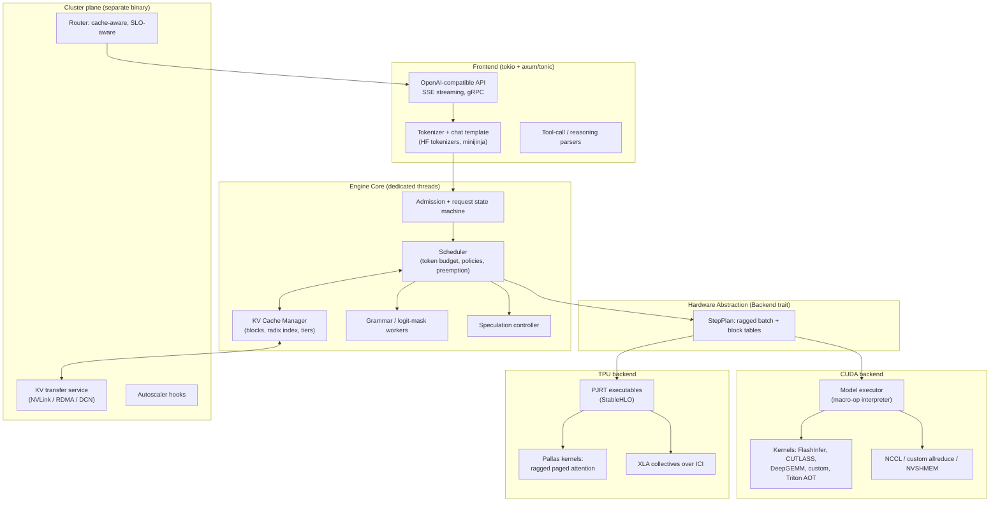
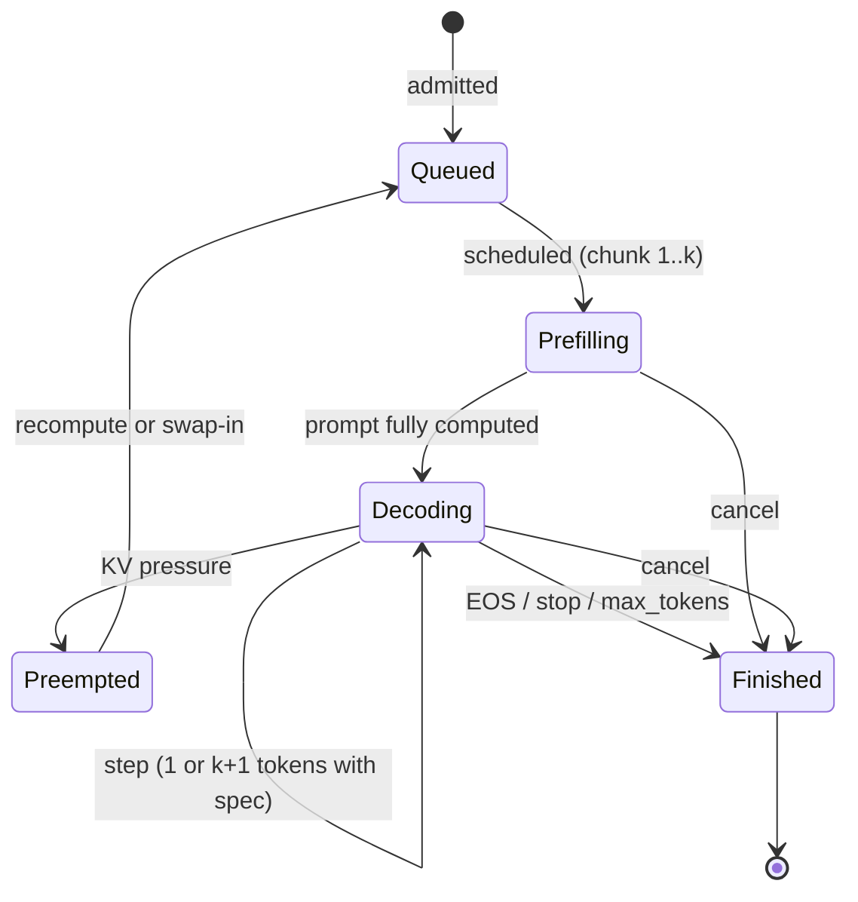
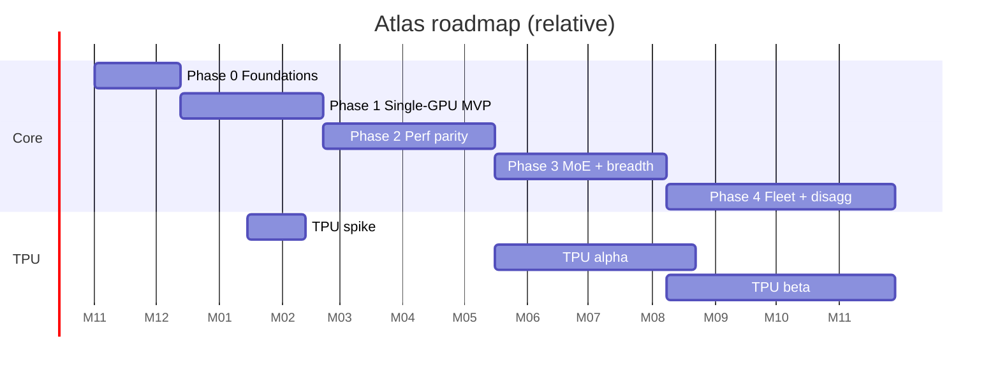

# Atlas: A Rust LLM Inference Engine (Design Doc + Roadmap)

*Codename "Atlas" is a placeholder. Version 0.1, October 2026. Ecosystem facts (versions, who supports what) move fast, so verify anything marked ⚠️ before committing to it.*

---

## 0. TL;DR

**Goal:** minimize **$ per million tokens** at a given latency SLO, on NVIDIA GPUs first, with a clean path to TPUs.

**Core thesis:**

1. Serving cost is mostly a function of **GPU utilization × memory efficiency × work avoided** (prefix reuse, speculation, quantization). It is not raw kernel speed alone.
2. vLLM, SGLang and TensorRT-LLM each solved a different slice. A new engine should combine:
   - vLLM's paged KV and continuous batching,
   - SGLang's radix prefix reuse, zero-overhead CPU scheduling and cache-aware routing,
   - TensorRT-LLM's kernel quality, ahead-of-time warmup discipline and quantization depth,
   - Mooncake / Dynamo-style disaggregation and tiered KV.
3. Rust's real advantages here are **no GIL, a deterministic CPU control plane, fearless concurrency, a single static binary, and a simulatable scheduler**. They are not "faster kernels". Kernels stay CUDA/Pallas/Triton; Rust owns everything around them.
4. **The hardware abstraction boundary is the single most important design decision.** Don't abstract at "tensor op" level (that's building a compiler). Abstract at **"execute this ragged batch step against this paged KV cache"**, with a **macro-op model IR** (about 25 fused ops) that GPU backends interpret and TPU backends lower to StableHLO.
5. **Build a second backend early** (a CPU reference backend in month 1, a TPU spike by month 3–4) so the abstraction is validated before it calcifies.

**Recommended wedge (what makes this worth building vs. contributing to vLLM/SGLang):**

- a hardware-portable core with a Rust control plane;
- cost-aware scheduling and cluster routing built in from day one (per-request GPU-second accounting);
- tiered KV cache (HBM → host → NVMe/remote) as a first-class feature, not a bolt-on;
- a deterministic **scheduler simulator** that lets you iterate on policy without GPUs.

---

## 1. Problem Framing: Where Does Serving Cost Come From?

```
$ / Mtok  =  (GPU $/hr) / (tokens/sec/GPU × 3600) × 1e6
```

To lower it, raise tokens/sec/GPU **at fixed SLO** (TTFT, TPOT/ITL, P99), or move to cheaper hardware. The levers:

| Lever | Mechanism | Who does it well today |
| --- | --- | --- |
| **Batch size / utilization** | Continuous batching, chunked prefill, no CPU stalls | vLLM, SGLang, TRT-LLM |
| **KV memory efficiency** | Paged blocks, KV quantization (FP8), MLA, sliding window | vLLM (paging), DeepSeek (MLA) |
| **Work avoidance** | Prefix/radix caching, cache-aware routing, KV tiering | SGLang (radix), LMCache, Mooncake |
| **Decode is memory-bound** | Speculative decoding (EAGLE/MTP/n-gram), quantized weights | all, to varying degrees |
| **Prefill vs decode interference** | Chunked prefill; **P/D disaggregation** | Sarathi-Serve, DistServe, Mooncake, Dynamo, llm-d |
| **Kernel efficiency** | Fused attention, FP8/FP4 GEMM, fused MoE, custom all-reduce | TRT-LLM, FlashInfer, DeepGEMM |
| **CPU overhead** | Async scheduling, CUDA graphs, no Python on hot path | SGLang overlap scheduler, TRT-LLM C++ runtime |
| **Cluster-level packing** | SLO-aware routing, autoscaling, multi-tenant LoRA | Dynamo, llm-d, Ray Serve |

**Key insight:** at small scale, kernels dominate. At fleet scale, **cache hit rate, batch fill, and P/D balance** dominate. Atlas should be designed so single-GPU performance is competitive *and* fleet-level levers are first-class.

---

## 2. What To Take From Each Existing Engine

### 2.1 Lessons table

|  | **vLLM** | **SGLang** | **TensorRT-LLM** |
| --- | --- | --- | --- |
| **Best idea** | PagedAttention + continuous batching; hybrid KV cache groups; huge model/hardware coverage | RadixAttention prefix tree; overlap ("zero-overhead") scheduler; cache-aware router; strong MoE/EP and DeepSeek serving; grammar-constrained decoding | Kernel quality (fused MHA/XQA, FP8/FP4, custom AllReduce); AOT warmup and CUDA graph discipline; deep quantization recipes |
| **Steal** | Block manager design, ref-counted blocks, token-budget scheduler, V1-style separated engine core | Async scheduling with "future tokens", radix tree for eviction *and* routing, structured-output pipeline | Plan-then-run execution, bucketed graphs, quantization format handling, in-flight batching semantics |
| **Avoid** | Python/GIL on the control path, large combinatorial feature matrix, scheduler complexity creep | Python scheduler overhead (mitigated but present), feature sprawl | Heavy engine-build step and lock-in to one vendor stack, hard-to-extend runtime |
| **Weakness to beat** | CPU overhead at high QPS/small models; config explosion | Operational polish; less hardware-agnostic | NVIDIA-only; flexibility |

### 2.2 Other prior art worth studying

- **FlashInfer**: attention kernel library with a *plan/run* API, load-balanced scheduling for ragged batches, cascade (shared-prefix) attention. Reuse it, don't rewrite it. ⚠️ Check current license/versions.
- **Sarathi-Serve**: stall-free chunked prefill. The scheduling model behind unified prefill+decode batches.
- **DistServe / Splitwise / Mooncake**: prefill/decode disaggregation and KV-centric architecture.
- **NVIDIA Dynamo / NIXL, llm-d, LMCache**: orchestration, KV transfer abstraction, KV offload. ⚠️ These evolve quickly.
- **xgrammar, llguidance**: grammar-constrained decoding. **llguidance is written in Rust**, so it can be used directly.
- **S-LoRA / Punica**: batched multi-adapter serving.
- **Rust-side prior art:** mistral.rs, candle, Hugging Face TGI (Rust router), Dynamo's Rust components. Study what they do, and be clear about how Atlas differs.
- **TPU-side prior art:** JAX + Pallas ragged paged attention, MaxText/JetStream, vLLM's TPU backend, SGLang-JAX. ⚠️ Verify current state.

---

## 3. Design Principles

1. **Control plane in Rust, data plane in kernels.** Rust never touches per-token math on the hot path; it orchestrates.
2. **Ragged-first.** Every step is a flat batch of tokens with `cu_seqlens`. No separate "prefill path" and "decode path" at the IR level. Chunked prefill, decode, speculative verification, and mixed batches are all the same shape of thing.
3. **Overlap everything.** While the device runs step *N*, the CPU plans step *N+1*, runs tokenizer/detokenizer work, and computes grammar masks.
4. **No allocation in the hot path.** Arena allocators for device workspace, pinned host buffers reused across steps, preplanned memory.
5. **Static where possible, dynamic where necessary.** Bucketed shapes + CUDA graphs on GPU; static shape buckets + AOT-compiled executables on TPU. Same abstraction: `ShapeBucket`.
6. **Capabilities, not `if backend == X`.** The core asks the backend what it supports (page sizes, quantization formats, spec-decode support) and adapts.
7. **Everything is simulatable.** The scheduler + KV manager run against a mock backend with a latency model. This is both a test strategy and a product feature (capacity planning).
8. **Cost is a first-class metric.** Every request carries GPU-time attribution. Benchmarks report $/Mtok under SLO, not just tokens/sec.
9. **Don't write kernels you can borrow.** Reuse FlashInfer / CUTLASS / DeepGEMM / NCCL at first; replace only where profiling proves a gap.
10. **Python-free serving path.** Python is allowed at *build time* (kernel authoring, TPU graph export), never in the request path.

---

## 4. System Architecture

### 4.1 Layered view



### 4.2 Threading and process model

Rust's lack of a GIL lets you simplify what vLLM had to split across processes:

- **One process per node by default.** Threads:
  - `tokio` runtime for I/O (HTTP, SSE, gRPC);
  - **engine thread** (scheduler + KV manager; single-writer, no locks on hot structures);
  - **one device-driver thread per accelerator** (submits steps, owns the device context);
  - a small **CPU worker pool** for tokenization, detokenization, grammar mask computation, and chat template rendering.
- Communication via bounded lock-free channels (`crossbeam` / `flume`). Message passing is preferred over shared state.
- **Optional process-per-device mode** for fault isolation (CUDA errors can poison a context). Same code, different spawn strategy.
- Multi-node: one engine core per replica; TP/EP across nodes handled by backend collectives, coordinated by a leader.

### 4.3 Request lifecycle



---

## 5. Component Design

### 5.1 Frontend

- **Crates:** `axum` + `tokio` (HTTP/SSE), `tonic` (gRPC), HF `tokenizers` (Rust-native), `minijinja` (chat templates).
- **API surface:** OpenAI Chat Completions + Completions first, then Responses API, embeddings, and an internal gRPC for the router.
- **Tool-call and reasoning parsers** are per-model plugins (Hermes-style, Llama, Qwen, DeepSeek, etc.), operating on the detokenized stream.
- **Incremental detokenization** runs on the CPU pool, off the engine thread.
- **Backpressure:** bounded queue per tenant. Reject early (429) rather than buffering unboundedly.

### 5.2 Engine core and scheduler

**Scheduling model:** token-budget, unified prefill/decode, in the style of Sarathi-Serve and vLLM V1. Each step has a budget (`max_num_batched_tokens`, `max_num_seqs`). The scheduler fills it in priority order:

1. running decodes (1 token each, or `1 + k` with speculation),
2. in-progress chunked prefills,
3. new requests (admitted only if KV blocks are available).

**Pluggable policy trait:**

```rust
pub trait SchedulePolicy: Send {
    /// Order candidates; may veto admission.
    fn rank(&self, ctx: &SchedCtx, cands: &mut [CandidateRef]);
    /// Choose preemption victim(s) under KV pressure.
    fn pick_victims(&self, ctx: &SchedCtx, need_blocks: usize) -> Vec<SeqId>;
    /// Optional chunk-size hint (e.g. shrink prefill chunks when TPOT SLO at risk).
    fn chunk_size(&self, ctx: &SchedCtx, seq: &SeqState) -> usize;
}
```

Ship these policies:

- `Fcfs`
- `Priority` (tenant tiers)
- `CacheAware` (prefer requests with high prefix-hit, SGLang-inspired)
- `SloAware` (EDF-style on TTFT/TPOT deadlines, with chunk-size throttling)

**Async / overlapped scheduling (critical for utilization):**

The classic problem: step *N+1*'s inputs depend on the tokens sampled in step *N*, so a naive loop idles the GPU while the CPU plans. The solution (SGLang-style "future tokens"):

1. Scheduler plans step *N+1* assuming each running sequence gets exactly one new token, referenced by a *placeholder* (`FutureToken { step: N, row: i }`).
2. The device resolves placeholders **on-device** by gathering from step *N*'s sampled-output buffer when step *N+1* launches.
3. When step *N* results arrive on the host, the scheduler **reconciles**: sequences that hit EOS/stop get their already-planned *N+1* slot discarded (one wasted token of compute is acceptable).
4. Stop-string detection lags by one step; this is handled by trimming output at the frontend.

Rust makes this much more tractable than in Python: the planning thread has real parallelism and pinned-buffer reuse is explicit.

**Preemption:** two modes, chosen per policy: *recompute* (drop KV, re-prefill, usually cheaper with prefix cache) and *swap* (move blocks to host tier). Default is recompute-with-prefix-cache; with tiering enabled, prefer swap for long contexts.

### 5.3 KV cache manager

This component is where most of the cost savings live, so it deserves the most care.

**Abstractions:**

- **`BlockPool`**: fixed-size physical blocks per *cache group*; free list; ref counts; O(1) alloc/free.
- **`CacheGroup`**: supports **hybrid models** (full attention layers + sliding-window layers + Mamba/linear-attention state + MLA compressed KV). Each group has its own `CacheSpec { kind, page_size, bytes_per_token, window }`. vLLM's hybrid KV manager is the reference idea. Design for it from day one, because retrofitting is painful.
- **`PrefixIndex`**: a **radix tree at block granularity** over token IDs (hash-chained block keys for O(1) lookup; tree structure for eviction ordering and for exporting to the router). Combines vLLM's hash-based block caching with SGLang's tree semantics.
- **Eviction:** LRU on leaf blocks with ref-count 0, with pluggable policy (e.g. cost-aware: evict blocks that are cheap to recompute, keep blocks for long shared system prompts).
- **Tiers:** `Hbm → HostDram → NvmeOrRemote`. Block moves are async copies on a dedicated stream/queue. The tier trait is the same one used for P/D KV transfer (see 5.9).

```rust
pub struct BlockId(u32);

pub trait KvTier: Send + Sync {
    fn capacity_blocks(&self) -> usize;
    fn write(&self, blocks: &[(BlockHash, BlockData)]) -> TransferHandle;
    fn read(&self, hashes: &[BlockHash], dst: &mut [BlockSlot]) -> TransferHandle;
    fn contains(&self, h: BlockHash) -> bool;
}
```

**Memory planning (startup):**

1. Load weights.
2. Run a profiling forward pass at the max bucket to measure activation/workspace peak.
3. `kv_bytes = total_mem × utilization − weights − activations − workspace − comms_buffers`.
4. Carve `BlockPool`s per cache group proportionally to layer counts and per-token bytes.

Plan memory once, allocate arenas once, never `cudaMalloc` in steady state.

**KV quantization:** FP8 KV from day \~60, with per-head or per-block scales stored beside blocks. The `CacheSpec` carries dtype and scale layout, and the attention backend declares which combos it supports.

### 5.4 The hardware abstraction (the part to get right)

**What crosses the boundary** is a `StepPlan`, a flat ragged batch that is identical in meaning for GPU and TPU:

```rust
pub struct StepPlan {
    pub step_id: u64,
    pub bucket: ShapeBucket,            // padded token / seq / page counts

    // Flat ragged token layout
    pub token_src: TokenSource,         // Host(ids) | DeviceFuture(prev_step, rows) | Mixed
    pub positions: PinnedSlice<u32>,
    pub cu_q_lens: PinnedSlice<u32>,    // query lengths per sequence (1 for decode, k+1 for spec, chunk for prefill)
    pub kv_lens: PinnedSlice<u32>,      // total context length per sequence

    // Paged KV addressing, per cache group
    pub block_tables: Vec<BlockTable>,  // [seq][max_blocks] per group
    pub slot_mapping: PinnedSlice<i64>, // where to write new KV

    // Per-sequence extras
    pub sampling: SamplingBatch,        // temp/top-p/top-k/penalties, seeds
    pub logit_mask: Option<BitmaskRef>, // grammar masks, computed async on CPU
    pub lora: Option<LoraBatch>,
    pub spec: Option<SpecVerifyInfo>,   // draft tokens + tree mask for verification

    // Tier / transfer side-effects scheduled alongside this step
    pub block_ops: Vec<BlockOp>,        // copy, swap-in/out, prefetch
}

pub trait Backend: Send + 'static {
    fn capabilities(&self) -> BackendCaps;       // page sizes, dtypes, spec support, max buckets...
    fn plan_memory(&self, m: &ModelSpec, cfg: &MemCfg) -> Result<MemoryPlan>;
    fn load_model(&mut self, m: &ModelSpec, w: &dyn WeightSource) -> Result<()>;
    fn init_kv(&mut self, plan: &KvPlan) -> Result<()>;
    fn warmup(&mut self, buckets: &[ShapeBucket]) -> Result<()>;   // graph capture / AOT compile

    fn submit(&mut self, plan: StepPlan) -> Result<StepTicket>;    // non-blocking
    fn wait(&mut self, t: StepTicket) -> Result<StepOutput>;       // sampled tokens, logprobs, spec accept info

    fn block_op(&mut self, ops: &[BlockOp]) -> Result<TransferHandle>;
    fn comm(&self) -> &dyn Collectives;                            // for TP/EP orchestration where needed
}
```

**Why this boundary works for both worlds:**

- GPU wants: ragged batch, block tables, CUDA-graph-friendly buckets. ✔
- TPU wants: static-shape buckets, ragged paged attention, one compiled executable per bucket. ✔
- Both want device-side sampling and device-side future-token resolution to avoid host round-trips. ✔

**Shape buckets** are the shared concept. On GPU a bucket selects a captured CUDA graph (decode) or piecewise graph (prefill); on TPU it selects a precompiled XLA executable. The core asks `capabilities()` for the bucket grid and pads plans accordingly.

### 5.5 Model definition: a macro-op IR (not a tensor compiler)

Building a general graph compiler is how inference-engine projects die. Instead:

- A model is Rust code that constructs a **`ModelGraph`** at load time out of \~25 *macro-ops*: `Embed`, `RmsNorm`, `LayerNorm`, `QkvProj`, `Rope(variant)`, `Attention(variant: Full | Sliding | MLA | Linear)`, `OProj`, `GatedMlp`, `MoeRouter`, `MoeExperts`, `SharedExpert`, `LmHead`, `Sample`, `AllReduce`, `AllToAll`, `LoraDelta`, …
- Each op has a declared **sharding spec** (replicated / column / row / expert / data-parallel-attention) so TP/EP/DP are expressed once.
- **GPU backend** *interprets* the graph: each macro-op maps to one or a few fused kernels. Capture the whole step in a CUDA graph per bucket.
- **TPU backend** *lowers* the entire graph to StableHLO (with Pallas custom calls for attention/MoE), compiles via PJRT, and caches executables.
- **Escape hatch:** a `CustomOp` registry so a new architecture can ship before every backend supports it.

This gives roughly 80% of models (Llama/Qwen/Mistral/Gemma-style dense, Mixtral/Qwen-MoE/DeepSeek-style MoE+MLA) with a small op set. New architectures usually mean one new attention variant or router, not a new compiler.

**Weights:** `safetensors` via `mmap` → pinned staging → device, with parallel shard loading. Quantized checkpoint handling (AWQ/GPTQ/FP8/NVFP4/MXFP4 layouts) lives in a `WeightTransform` layer that is backend-aware but shared. Optional GPUDirect Storage later.

### 5.6 CUDA backend

**Foundation crates:** `cudarc` (driver API, NVRTC, cuBLAS/cuBLASLt, NCCL bindings) ⚠️ verify maturity for your needs; `half`; custom FFI crate for kernel libraries.

**Kernel sourcing strategy (the pragmatic part):**

| Need | Phase 1 (reuse) | Phase 2+ (own, where profiling justifies) |
| --- | --- | --- |
| Attention (prefill/decode/ragged/paged) | FlashInfer, built AOT into cubins | Own persistent/split-KV decode kernel; cascade attention |
| MLA attention | FlashInfer / FlashMLA-class kernels | Own, if gaps |
| Dense GEMM | cuBLASLt, CUTLASS | CUTLASS-based fused epilogues |
| FP8 / FP4 GEMM | CUTLASS, DeepGEMM-class | Autotuned per-shape tables |
| MoE (grouped GEMM, routing, permute) | CUTLASS grouped GEMM + custom routing | Fused MoE (Triton-AOT or CUDA), DeepEP-style dispatch |
| Norm / RoPE / activation / sampling | Small custom CUDA kernels (easy, high fusion value) | Further fusion |
| All-reduce | NCCL | Custom one-shot/two-shot NVLink all-reduce |

**Kernel packaging:** `build.rs` drives `nvcc`/Triton AOT to produce fatbins for the target SM archs (sm_80, sm_90, sm_100/103, sm_120 as needed); loaded at runtime through the driver API. Feature-gate per arch to keep binaries sane.

**CUDA graphs:** captured per decode bucket at warmup; piecewise graphs for prefill (graph the dense parts, run attention eagerly or with a fixed-plan kernel). Warmup is deterministic and cached, with TRT-LLM-style discipline: no surprises at request time.

**Streams:** compute, H2D, D2H, and KV-tier-copy streams, with events for dependencies. The driver thread owns all of them.

### 5.7 TPU backend

TPUs are a different execution model: XLA-compiled static programs, systolic MXUs, ICI mesh collectives, Pallas/Mosaic for custom kernels. Be honest about the cost: this is the highest-risk part of the plan.

**Integration path:** Rust talks to TPU through the **PJRT C API** (via Rust PJRT bindings ⚠️ verify the current crate landscape, or write thin bindings against the C API). PJRT gives compile, execute, buffer management, and (on multi-chip) sharded execution.

**Three options for producing the XLA program:**

| Option | Description | Pros | Cons |
| --- | --- | --- | --- |
| **A. Rust lowers macro-ops → StableHLO** | Backend builds HLO text/MLIR from `ModelGraph` | One model definition; Python-free; best long-term | Most work; need Pallas kernels as custom calls anyway |
| **B. Offline JAX export** | Python (build-time only) defines models, exports StableHLO + Pallas kernel artifacts; Rust loads & runs | Fastest path to a working TPU backend; leverages JAX ecosystem | Models defined twice; export pipeline to maintain |
| **C. Embed Python/JAX at runtime** | Rust shells into JAX | Easiest | Reintroduces GIL and overhead. **Reject.** |

**Recommendation:** **B for the TPU alpha** (validate the abstraction and the scheduler on real TPU hardware within weeks), **converging on A** for the model families that matter. Keep Python out of the request path in both.

**Mapping the core abstractions to TPU:**

- `ShapeBucket` → one precompiled executable per `(num_tokens, num_seqs, max_pages)` bucket, persisted in a compilation cache. Warmup compiles the full grid at startup (or loads from cache).
- Attention → **ragged paged attention** (Pallas kernel). Page size is dictated by the backend through `capabilities()`, and the KV manager supports a per-backend page size.
- Sharding → the graph's sharding specs become GSPMD/Shardy annotations; XLA inserts collectives over ICI. No hand-written NCCL equivalent.
- No CUDA-graph analog is needed: an XLA executable is already a single launch.
- Sampling and future-token resolution stay on-device, same as GPU.
- MoE → grouped/ragged matmul approaches (megablox-style) ⚠️ verify the state of the art.
- Quantization → int8 broadly, FP8 where the TPU generation supports it.
- KV tiering and P/D over DCN use the same `KvTier` trait with a different transport.

**What this means for the core:** nothing in `atlas-core` may assume CUDA semantics (streams, pointer arithmetic on block tables, dynamic shapes). Enforce this with a CI job that builds and runs the whole core against the mock and CPU backends.

### 5.8 Sampling, structured output, speculative decoding

**Sampling:** on-device (temperature, top-k/p, min-p, penalties, seeded RNG per sequence, logprobs), with a fused sampling kernel on GPU.

**Structured output:**

- Grammar engine as a CPU worker pool. Start by integrating **llguidance** (Rust) ⚠️ evaluate vs. xgrammar FFI; compute token bitmasks asynchronously for step *N+1* while step *N* runs.
- Bitmask is uploaded as a packed tensor and applied inside the sampling kernel.
- Jump-forward decoding (SGLang idea): when the grammar forces a deterministic span, append it without model calls.

**Speculative decoding:** the step format already supports `q_len > 1` per sequence, so speculation is a scheduler feature, not a special path.

- Phase 1: n-gram / prompt-lookup (no extra model; wins on code/RAG/summarization).
- Phase 2: EAGLE-style draft heads and MTP heads (DeepSeek/Qwen-style).
- Phase 3: tree verification with a tree attention mask; adaptive `k` per sequence based on observed acceptance, with the *cost model* deciding when speculation pays (at large batch, speculation can hurt throughput, so the scheduler should turn it off).

### 5.9 Parallelism and communication

| Strategy | Use | Notes |
| --- | --- | --- |
| **TP** (tensor) | Dense layers, within a node | NCCL → custom all-reduce on NVLink |
| **PP** (pipeline) | Multi-node when TP bandwidth is insufficient | Microbatching handled by scheduler |
| **EP** (expert) | MoE | All-to-all dispatch/combine; DeepEP-style low-latency kernels later |
| **DP-attention** | MoE/MLA models (DeepSeek style) | Attention data-parallel, experts expert-parallel; avoids KV duplication |
| **CP** (context) | Very long context | Later |
| **DP replicas** | Throughput scale-out | Router-level |

Rules:

- Parallelism is expressed in the **graph's sharding specs** (so the TPU path reuses it).
- A `Collectives` trait lets the core stay agnostic.
- **EPLB** (expert-load balancing / replication of hot experts) is a Phase 3 item.

### 5.10 Disaggregation, KV transfer, and the router

**Why:** prefill is compute-bound, decode is memory-bound; separating them lets each be scaled and tuned independently, and removes prefill↔decode interference. It pays off most with long prompts, strict TPOT SLOs, and large fleets, so it should *not* be the default for small deployments.

**Design:**

- `KvTransport` trait (same family as `KvTier`): implementations for NVLink/P2P intra-node, RDMA/UCX/NIXL-style inter-node ⚠️ evaluate reuse of NIXL, TCP fallback, and DCN for TPU.
- Layer-wise streaming of KV from prefill to decode workers, overlapped with compute.
- Prefix-aware: decode-side radix index is consulted so already-present blocks aren't re-sent.

**Router (separate Rust binary, `atlas-router`):**

- Consumes **radix-tree summaries** exported by workers, and routes to the replica with the best expected cache hit.
- Load model: queued tokens, KV pressure, recent TPOT.
- SLO-aware: send tight-SLO requests to less loaded replicas.
- Multi-tenant fairness and rate limits.
- Pluggable discovery (Kubernetes, static, etcd).

### 5.11 Quantization

| Item | Plan |
| --- | --- |
| Weights | FP8 (W8A8) first; then INT4 AWQ/GPTQ (W4A16); NVFP4/MXFP4 on Blackwell; INT8 on TPU |
| Activations | Dynamic per-token FP8 quant fused into preceding op |
| KV cache | FP8 first; INT4/FP4 KV experimental |
| Calibration | Out of scope for the engine; consume existing checkpoints (ModelOpt, llm-compressor, AWQ). Provide a validation harness (perplexity + task evals) |
| Policy | Quantization is a **property of the `ModelSpec` and `CacheSpec`**, with capabilities checks. The backend refuses unsupported combos at load, not at runtime |

### 5.12 Multi-LoRA and multimodal (later phases)

- **Multi-LoRA:** batched adapter application (Punica/S-LoRA style kernels), adapter LRU in HBM/host, scheduler awareness (batch by adapter where it helps). The `LoraDelta` macro-op and `lora` field in `StepPlan` are reserved from day one.
- **Multimodal:** a separate **encoder stage** with its own cache (embeddings keyed by content hash), optionally disaggregated (E/P/D). The KV manager treats image tokens as ordinary tokens with special hashes for prefix caching.

### 5.13 Observability and cost accounting

- `tracing` + OpenTelemetry spans per request and per step.
- Prometheus metrics: queue depth, batch tokens, KV utilization per tier, prefix hit rate, TTFT/TPOT histograms, spec acceptance rate, graph bucket hit rate, padding waste.
- **GPU-second attribution:** each step's measured device time is split across sequences proportional to their token share, then aggregated per request/tenant. This enables *real* cost-per-request reporting and cost-aware routing.
- **Step flight recorder:** ring buffer of the last N `StepPlan`s and outputs, dumped on error. This makes it possible to reproduce production bugs in the simulator.
- Chrome-trace/Perfetto export of the scheduler timeline.

---

## 6. Repository / Crate Layout

```
atlas/
├─ crates/
│  ├─ atlas-types/        # IDs, SamplingParams, StepPlan, BackendCaps, errors (no deps on runtime)
│  ├─ atlas-core/         # scheduler, request state machine, KV manager, speculation controller
│  ├─ atlas-kv/           # BlockPool, PrefixIndex (radix), tiers, eviction
│  ├─ atlas-model/        # ModelGraph IR, macro-ops, model definitions (llama, qwen, moe, mla...)
│  ├─ atlas-weights/      # safetensors, quant formats, WeightTransform
│  ├─ atlas-tokenizer/    # tokenizer, chat templates, detok, tool/reasoning parsers
│  ├─ atlas-grammar/      # structured-output integration
│  ├─ atlas-server/       # axum/tonic frontend, OpenAI API, metrics
│  ├─ atlas-backend/      # Backend trait + shared utilities (arenas, pinned buffers)
│  ├─ atlas-backend-mock/ # latency-model backend for simulation/tests
│  ├─ atlas-backend-cpu/  # slow reference backend (correctness oracle, 2nd backend validation)
│  ├─ atlas-backend-cuda/ # cudarc, kernel FFI, graphs, NCCL
│  ├─ atlas-backend-tpu/  # PJRT, executable cache, Pallas artifacts
│  ├─ atlas-comm/         # Collectives, KvTransport traits + impls
│  ├─ atlas-router/       # cluster router binary
│  ├─ atlas-sim/          # discrete-event simulator + workload generators
│  └─ atlas-bench/        # benchmark harness ($/Mtok under SLO)
├─ kernels/
│  ├─ cuda/               # custom CUDA sources, build scripts
│  ├─ triton/             # Triton AOT sources
│  └─ pallas/             # Pallas sources + export scripts (build-time Python)
├─ evals/                 # parity tests vs. HF reference, quality evals
└─ docs/                  # ADRs, design docs
```

**Dependency rule:** `atlas-core` depends on `atlas-types`, `atlas-kv`, and the `Backend` trait only. It must never import a concrete backend or any CUDA/PJRT crate. Enforce with `cargo deny` / a CI check.

---

## 7. Testing, Benchmarking, and Quality

**Correctness**

- **Logit parity tests** vs. HF Transformers reference on small and mid models (tolerances per dtype; separate FP8/FP4 acceptance via task-level evals).
- **Greedy-decode determinism** tests: batch-invariance checks (same output regardless of batch composition) where kernels permit; document where they don't.
- **Property and fuzz tests** for `BlockPool` / `PrefixIndex` (ref-count conservation, no double-free, eviction safety). Use `proptest` and `loom` for concurrent structures.
- **Cross-backend tests:** every model runs on `cpu` and `mock` in CI; `cuda` and `tpu` on hardware runners.

**Scheduler simulation (a differentiator)**

- `atlas-sim` runs the real scheduler + KV manager against `atlas-backend-mock` with a *calibrated latency model* (fit from real GPU step timings by `(num_tokens, num_seqs, kv_len)`).
- Replay production traces, sweep policies, and estimate fleet capacity *without GPUs*. This is also how you prove that policy changes help before shipping.

**Benchmarks (standardized and honest)**

- Workloads: chat (short in/short out), RAG (long in/short out), code completion (high prefix reuse), agentic (multi-turn with shared prefix), long-context, reasoning (long out), structured-output.
- Metrics: throughput, TTFT, TPOT P50/P99, **goodput under SLO**, **$/Mtok**, prefix hit rate, GPU utilization (SM active, memory BW), CPU overhead per step.
- Baselines: vLLM, SGLang, TensorRT-LLM (and Dynamo for disaggregated) on identical hardware, versions pinned, and configs tuned fairly. Publish scripts. Credibility matters more than a single flattering number.

---

## 8. Roadmap

Timelines assume a **team of 3–4 strong engineers** (see §9). Adjust proportionally. Each phase has an **exit criterion** so you know when to move on.

### Phase 0: Foundations (Weeks 0–6)

- Workspace, CI, `atlas-types`, `Backend` trait draft, **mock backend + simulator skeleton**.
- Tokenizer/chat-template/detok pipeline, safetensors loader.
- **CPU reference backend** for a tiny Llama-architecture model (the correctness oracle *and* abstraction test #1).
- Benchmark harness skeleton and workload generators.
- ADRs for the key decisions in §11.

**Exit:** a tiny model generates correct text end-to-end on the CPU backend through the real scheduler and API.

### Phase 1: Single-GPU MVP (Months 2–4)

- CUDA backend via `cudarc`: model loading, FlashInfer-based paged attention, cuBLAS GEMMs, custom norm/RoPE/sampling kernels.
- Paged KV manager (single cache group), continuous batching + **chunked prefill**, token-budget scheduler.
- CUDA graph capture for decode buckets.
- OpenAI-compatible API with streaming.
- Dense models: Llama-3-family and Qwen-family, BF16.
- **TPU spike** (parallel, 1 engineer for 3–4 weeks): run a small dense model on a TPU via PJRT using option B (exported StableHLO + Pallas ragged paged attention) *with the same `StepPlan`*. Goal is to find abstraction leaks early.

**Exit:** within a reasonable margin of vLLM on single-GPU dense-model throughput at fixed latency for chat workloads, with logit parity. `StepPlan` survives the TPU spike with at most small modifications.

### Phase 2: Performance Parity (Months 4–7)

- **Async/overlapped scheduling** with device-side future tokens.
- **Prefix caching** (radix index + eviction) and cascade/shared-prefix attention.
- FP8 weights/activations and FP8 KV.
- TP across GPUs via NCCL; custom all-reduce as a stretch.
- Structured output (llguidance), n-gram speculative decoding.
- Observability + GPU-second accounting.
- Benchmarks vs. vLLM / SGLang published, honestly.

**Exit:** matching or beating vLLM/SGLang on at least the prefix-heavy and structured-output workloads; CPU overhead per step measured and low.

### Phase 3: Breadth and MoE (Months 7–10)

- MoE: grouped GEMM, fused routing, **EP**, DP-attention; DeepSeek-class (MLA) support; hybrid cache groups (sliding window, linear attention).
- EAGLE/MTP speculative decoding with adaptive `k`.
- Multi-LoRA.
- **KV tiering** (host DRAM, then NVMe/remote).
- `atlas-router` v1: cache-aware + load-aware routing.
- TPU backend moves from spike to **alpha**: TP/EP via sharding specs, executable cache, a few model families.

**Exit:** serves a flagship open MoE model at competitive cost; router demonstrably raises fleet-wide prefix hit rate.

### Phase 4: Fleet and Disaggregation (Months 10–14)

- **P/D disaggregation** with `KvTransport` (NVLink, RDMA, TCP), layer-wise streaming.
- SLO-aware scheduler policy; autoscaling hooks and a Kubernetes operator/Helm chart.
- Blackwell-specific paths (NVFP4/MXFP4 GEMM and KV).
- TPU backend **beta** (A-path lowering for the main model families; multi-host).
- Cost-aware routing across heterogeneous hardware (GPU + TPU) using the GPU-second accounting.

**Exit:** a published reference deployment showing $/Mtok under SLO versus a colocated baseline.

### Phase 5: Ecosystem (Months 14+)

- Multimodal with encoder disaggregation; long-context (CP); more architectures; AMD/ROCm or other backends if demand exists.
- Plugin API for models/backends/policies; stable public crates.
- Community: contribution guides, model-porting guide ("a new model in a day").

### Milestone summary



---

## 9. Team and Resourcing

Suggested starting team and the skills each role must cover:

| Role | Focus |
| --- | --- |
| **Runtime/scheduler lead** | Async Rust, scheduler, KV manager, simulator, correctness of concurrency |
| **GPU kernels/perf engineer** | CUDA/CUTLASS/Triton, profiling (Nsight), FlashInfer integration, quantization kernels |
| **Distributed systems engineer** | NCCL/EP/PD transfer, router, K8s, observability |
| **TPU/XLA engineer** (from Month 3) | PJRT, StableHLO, Pallas, sharding |

**Hardware budget matters.** Plan for: dev boxes with 1–2 consumer/datacenter GPUs, a rented 8×H100/H200-class node for TP/EP work, Blackwell access by Phase 4, and TPU access (e.g., via cloud) from Month 3. CI should have at least one real-GPU runner for nightly parity and perf regression tests.

---

## 10. Risks and Mitigations

| Risk | Likelihood / Impact | Mitigation |
| --- | --- | --- |
| **Scope explosion** (trying to match vLLM's 100+ models) | High / High | Support a *small* set (3–5 families) very well; make model porting easy rather than broad |
| **Kernel gap vs. TRT-LLM/FlashInfer** | Medium / High | Reuse existing kernels in Phase 1–2; invest in own kernels only where profiling proves a gap |
| **Rust-CUDA ecosystem immaturity** | Medium / Medium | Treat Rust as the orchestrator; kernels via FFI/cubins; contribute upstream to `cudarc` where needed |
| **TPU abstraction leaks** | High / High | CPU backend in Phase 0, TPU spike in Phase 1; weekly review of "does the core know about CUDA?" |
| **TPU compile times and static-shape limits** | Medium / Medium | Bucketing + persistent compile cache; limit bucket grid; accept some padding waste |
| **Moving target** (new model archs, attention variants, quant formats every month) | High / Medium | Macro-op IR with `CustomOp` escape hatch; stay close to upstream research; modular `CacheSpec` |
| **Differentiation unclear** | Medium / High | Commit to the wedge: portability + cost-aware scheduling/routing + tiered KV + simulator. Measure and publish $/Mtok under SLO |
| **Async scheduling correctness bugs** (reconciliation, stop handling) | Medium / High | Simulator + property tests + flight recorder; ship behind a flag, then default |
| **Benchmark credibility** | Medium / Medium | Publish scripts, pin versions, tune baselines fairly |
| **Funding / adoption** | Medium / High | Early design partners with real workloads (prefix-heavy agent/RAG traffic benefits first) |

---

## 11. Key Decisions (ADRs to Write in Phase 0)

| # | Decision | Recommendation | Revisit when |
| --- | --- | --- | --- |
| 1 | Hardware abstraction level | `StepPlan` + `Backend` trait, ragged-first | TPU spike results |
| 2 | Model IR | Macro-op graph with sharding specs; no general tensor compiler | If >30% of new models need `CustomOp` |
| 3 | Process model | Single process, thread per device; optional process-per-device | Fault-isolation incidents |
| 4 | Attention kernels | FlashInfer (AOT) first | Profiling shows >10% gap in key workloads |
| 5 | GPU binding | `cudarc` + FFI to C++ kernels | If gaps block progress (consider thin bespoke bindings) |
| 6 | TPU path | Option B (JAX export) → A (Rust lowering) | After TPU beta |
| 7 | Prefix cache structure | Block-granular radix tree with hash-chained keys | Hybrid models complicate hashing |
| 8 | Async scheduling | Device-side future tokens + reconcile | If reconciliation bugs persist |
| 9 | Grammar engine | llguidance (Rust) vs. xgrammar FFI | Benchmark mask-compute latency |
| 10 | Communication | NCCL first; custom all-reduce and NVSHMEM-class later | EP latency profiling |
| 11 | KV transfer | Own `KvTransport` trait; evaluate wrapping NIXL | Before Phase 4 |
| 12 | License | Apache-2.0 (compatible with the ecosystem you'll link to) | Before first public commit |

**License hygiene:** reading papers and public design docs is fine. If you want the "not copying" principle to be auditable, keep implementation notes in `docs/` citing the *papers/ideas* you drew from, and review any copied-in snippets for license compatibility. Linking Apache-2.0 / BSD libraries (FlashInfer, CUTLASS, NCCL-as-binary, etc.) is normal, but ⚠️ verify each license and any NVIDIA redistribution terms for your packaging.

---

## 12. First 30 Days: A Concrete Checklist

1. Create the workspace and CI (fmt, clippy, `cargo deny`, layering check).
2. Write `atlas-types`: `StepPlan`, `ShapeBucket`, `BackendCaps`, `CacheSpec`, request/sequence IDs.
3. Implement `BlockPool` + `PrefixIndex` with property tests (this is self-contained and valuable immediately).
4. Implement the scheduler against the mock backend; drive it from `atlas-sim` with synthetic workloads.
5. Tokenizer + chat template + detok pipeline; OpenAI-style streaming endpoint against the mock.
6. CPU reference backend for a tiny Llama-architecture model; parity check against HF.
7. Benchmark harness that outputs goodput under SLO and $/Mtok (given a $/GPU-hr input).
8. Write ADRs 1–3 and 12.
9. Rent a GPU box and start the CUDA backend: weight load → one forward pass → logit parity.
10. Decide on early design partners and the first target workload (recommendation: prefix-heavy agentic/RAG chat on a 8B–32B dense model, then one MoE).

---

## 13. Reading List

- *Efficient Memory Management for LLM Serving with PagedAttention* (vLLM)
- *SGLang: Efficient Execution of Structured Language Model Programs* (RadixAttention)
- *Sarathi-Serve* (stall-free chunked prefill)
- *DistServe* and *Splitwise* (P/D disaggregation)
- *Mooncake* (KV-centric serving architecture)
- *FlashAttention 1–3* and *FlashInfer*
- *EAGLE / EAGLE-2/3*, *Medusa*, DeepSeek *MTP* (speculative decoding)
- *S-LoRA* / *Punica* (multi-adapter serving)
- *DeepSeek-V2/V3* technical reports (MLA, MoE, EP serving)
- *xgrammar* and *llguidance* docs (structured output)
- JAX Pallas docs and the ragged paged attention kernel; OpenXLA PJRT and StableHLO specs
- Source-reading (for architecture, not copying): vLLM V1 engine core, SGLang scheduler/overlap loop, TensorRT-LLM executor, Dynamo, mistral.rs

---

## Appendix A: Minimal Engine Loop (Sketch)

```rust
// Engine thread: overlapped scheduling with device-side future tokens.
loop {
    // 1. Drain new requests / cancels from the frontend channel.
    admit_new_requests(&mut state, &rx_frontend);

    // 2. Plan step N+1 while step N is still on device.
    let plan = scheduler.plan(&mut state, &kv);          // token budget, policy, chunking
    let plan = grammar.attach_masks(plan);               // async-computed bitmasks, if ready
    let plan = spec.attach_drafts(plan);                 // n-gram / EAGLE drafts

    // 3. Submit (non-blocking). Tokens for running seqs are DeviceFuture refs.
    let ticket = backend.submit(plan.into_step_plan(prev_ticket))?;

    // 4. Collect results of step N (blocks only if the device is behind).
    if let Some(prev) = in_flight.pop_front() {
        let out = backend.wait(prev.ticket)?;
        // 5. Reconcile: stop conditions, spec accept/reject, free/commit KV blocks,
        //    discard speculative-over-planned slots, publish tokens to frontends.
        scheduler.reconcile(&mut state, &mut kv, prev.plan, out, &tx_frontend);
        metrics.record_step(&prev, &out);                // incl. GPU-second attribution
    }
    in_flight.push_back(InFlight { ticket, plan_meta });
}
```

## Appendix B: Capability Negotiation Example

```rust
pub struct BackendCaps {
    pub kv_page_sizes: Vec<u32>,                 // GPU: [16, 32, 64]; TPU: backend-specific
    pub kv_dtypes: Vec<DType>,                   // BF16, FP8_E4M3, ...
    pub weight_formats: Vec<QuantFormat>,        // FP8, AWQ-INT4, NVFP4, INT8 ...
    pub attention_variants: Vec<AttnVariant>,    // Full, Sliding, MLA, Linear
    pub supports_spec_tree: bool,
    pub supports_lora: bool,
    pub bucket_grid: BucketGrid,                 // allowed padded shapes
    pub dynamic_shapes: bool,                    // false on TPU
    pub device_future_tokens: bool,              // required for overlapped scheduling
    pub collectives: CollectiveCaps,             // allreduce/all2all/p2p variants
}
```

The core chooses page size, bucket padding, and feature toggles *from this struct*. There is no `#[cfg(cuda)]` in `atlas-core`.